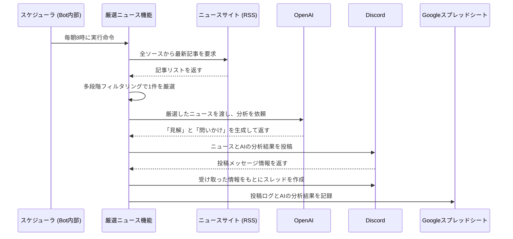
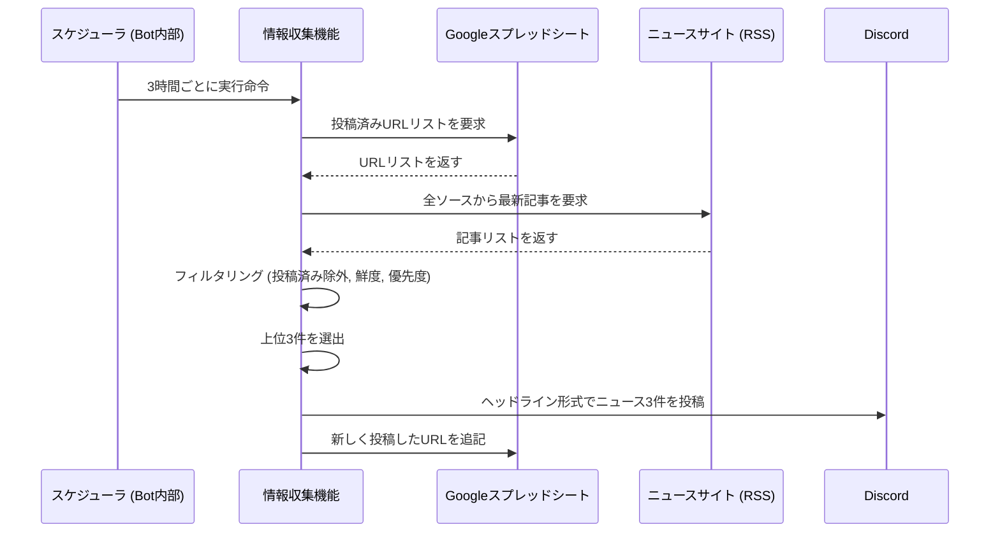
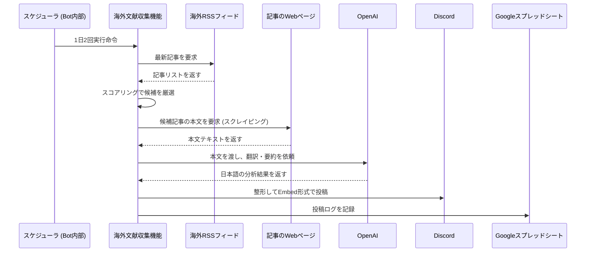
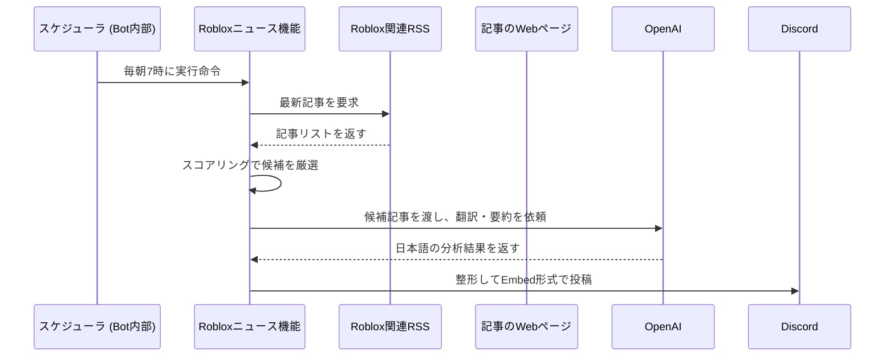
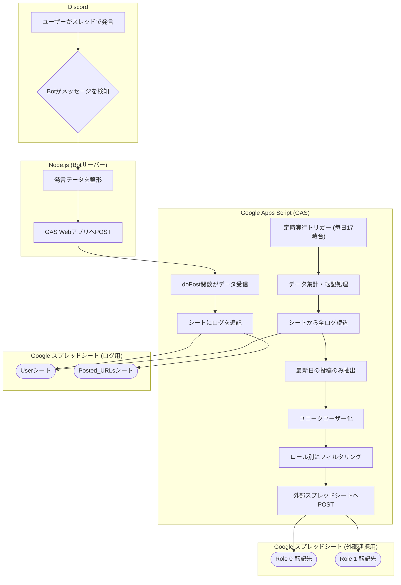

# Daily News Bot for Discord

## 概要 (Overview)

このBotは、AIによるインテリジェントなニュース分析機能と、コミュニティの活動を自動で記録するロギング機能を備えた高機能Botです。単なる情報配信に留まらず、コミュニティの対話を活性化させ、その知見を資産として蓄積することを目指します。

1.  **AI研究員による厳選ニュース配信 (毎日 AM 8:00)**:
    国内のニュースサイトから「一次産業 × テクノロジー」に関連する最も重要なニュースを1つだけ選び出し、**AI（GPT-4o）が生成した独自の「見解」と「問いかけ」**を添えて投稿します。

2.  **国内情報収集ヘッドライン (AM 6:00 - PM 18:00 / 3時間ごと)**:
    幅広いニュースソースから、**スコアリング方式**で関連性の高い最新ニュースを最大3件抽出し、情報収集用のチャンネルに投稿します。コミュニティの関心に合わせてスコアを調整可能です。

3.  **海外文献ダイジェスト (毎日 AM 10:00 & PM 19:00)**:
    世界の主要な農業技術・ビジネス情報源から最新の英語文献を収集。**スコアリングで厳選後、記事本文をスクレイピングし、AIが日本語に翻訳・要約**して、専門用語の解説付きで投稿します。

4.  **Roblox関連のビジネス・アップデート速報 (毎日 AM 7:00):**:
    Roblox関連の英語ニュースをスコアリングで厳選し、AIがビジネスの要点を日本語で翻訳・要約して配信します。

5.  **活動ログの自動記録**:
    投稿されたニューススレッド内での全発言を、発言者情報（ロール判定含む）と共にGoogleスプレッドシートに自動で記録・蓄積します。

---

## ✨ 主な機能 (Features)

- **AIによるニュース分析・翻訳・要約**: GPT-4oを活用し、国内ニュースへの「見解」付与や、海外の英語文献の高度な日本語要約を自動生成。
- **高度なスコアリング方式**: 複数のキーワードカテゴリ（技術、消費者体験、社会課題など）に基づいてニュースを点数付けし、コミュニティの関心に合致した情報を高精度で選出。
- **Webスクレイピング**: RSSフィードに概要がない場合でも、記事のWebページから直接本文を取得し、AIの分析精度を向上。
- **デュアル国内ニュース配信**: 目的の異なる2つの国内ニュース配信タスクをスケジュール実行。
- **重複投稿防止**: 一度投稿したニュースはキャッシュし、再度投稿しない仕組みを搭載。
- **Googleスプレッドシート連携**: Google Apps Script (GAS) をWebアプリとして利用し、Discordでの活動データを安全かつリアルタイムに記録。
- **ユーザーロール判定**: 議論に参加したユーザーが特定のロールを持っているかを判定し、ログに記録。
- **自動デプロイ**: GitHubのmainブランチへのプッシュをトリガーに、GitHub ActionsがDockerコンテナを自動でビルド＆デプロイ。

---

## 機能の仕組み

### 1. AI研究員による厳選ニュース配信 (毎日 AM 8:00)

AIがファシリテーターとなり、コミュニティでの質の高い議論を創出します。



### 2. 情報収集ヘッドライン (AM 6:00 - PM 18:00 / 3時間ごと)

個人の情報収集をサポートするため、幅広いニュースソースから関連性の高い最新ニュースを最大3件、重複なく届け続けます。



### 3. 海外文献ダイジェスト (毎日 AM 10:00 & PM 19:00)

収集、フィルタリング、スクレイピング、AI分析という多段階のプロセスを経て、世界の最先端情報を届けます。


### 4. Robloxビジネス・アップデート速報 (毎日 AM 7:00)

収集からAI分析、投稿までを自動化し、Robloxのビジネス動向を効率的にキャッチアップします。


*（注：Robloxニュースは現在、ログ記録の対象外です）*

#### 選定ロジックの詳細

**目的**: ブランドの活用事例やプラットフォームの大型アップデートなど、ビジネス上の重要ニュースに絞り込み、その要点を日本語で速報する。

**処理フロー**:
1.  **【記事収集】**: 登録されたRSSフィードから、過去24時間以内のRoblox関連ニュースをすべて収集します。

2.  **【スコアリング】**: 収集した各記事を、以下の4つのカテゴリで評価し、スコアを付けます。
    *   `ビジネス/ブランド活用`: **+5点**（`partnership`, `brand`, `virtual store`など）
    *   `プラットフォームアップデート`: **+5点**（`update`, `feature`, `engine`, `studio`など）
    *   `財務/市場動向`: **+4点**（`earnings`, `revenue`, `stock`, `investment`など）
    *   `技術/イノベーション`: **+3点**（`AI`, `metaverse`, `VR`など）

3.  **【フィルタリング】**: スコアの合計が**4点未満**の記事は、重要度が低いと判断し、この時点で除外します。

4.  **【最終選定】**: フィルタリングを通過した記事をスコアの高い順に並べ替え、翻訳・要約の対象として**上位最大5件**を選出します。

5.  **【AIによる翻訳・要約】**: 選定された記事のタイトルと概要をGPT-4oに渡し、**「メタバースとゲーム業界の専門アナリスト」**という役割（ペルソナ）を与えて、ビジネスパーソン向けの日本語要約を生成させます。概要が短い場合でも、タイトルから内容を推測して要約を作成するように指示しています。

6.  **【Discordへの投稿】**: AIが生成した日本語タイトルと要約を、スコアやカテゴリと共に、見やすい`Embed`形式で指定されたチャンネルに投稿します。

---

## ニュース選定ロジックの詳細 (Scoring Logic Details)

このBotの心臓部である、ニュースを自動で選定するスコアリングロジックについて解説します。国内と海外で、目的の異なるロジックを実装しています。

### 1. 国内情報収集ヘッドラインのスコアリング

**目的**: コミュニティの関心（ヒト、体験、社会課題など）を多角的に評価し、議論のきっかけとなりやすい多様なニュースを選出する。

**処理フロー**:
1.  **【必須条件】**: まず、記事に`CORE_AGRI_KEYWORDS`（`'農業'`, `'農家'`など）が1つでも含まれているかをチェックします。含まれていない場合、その記事は処理対象外となります。

2.  **【カテゴリ別スコアリング】**: 必須条件をクリアした記事に対し、以下のカテゴリに合致するキーワードが含まれていれば、それぞれ点数を加算します。
    *   `技術革新`: **+5点**
    *   `消費者体験・6次産業化`: **+5点**
    *   `ヒト・人材・ストーリー`: **+4点**
    *   `社会課題・サステナビリティ`: **+4点**
    *   `ビジネス・政策・制度`: **+3点**
    *   `コア農業・一次産業`: **+2点** (基礎点)
    *   `ボーナス・バズワード`: **+2点**

3.  **【シナジーボーナス】**: さらに、特定のカテゴリが組み合わさることで、より価値の高い記事と判断し、ボーナス点を加算します。
    *   `コア農業` + `技術革新` → **+10点**
    *   `コア農業` + `消費者体験` → **+8点**

4.  **【最終選定】**: 全カテゴリのスコアとボーナスを合計し、スコアの高い順に記事を並べ替え、上位3件を選出します。

---

### 2. 海外文献ダイジェストのスコアリング

**目的**: AgriTech（農業×技術）分野の重要文献を最優先で選出し、世界の最先端の研究開発動向を捉えることに特化する。

**処理フロー**:
1.  **【必須条件】**: 国内ニュースと同様に、記事に`GLOBAL_AGRI_KEYWORDS`（`'agriculture'`, `'farming'`など）が含まれていなければ、処理対象外とします。

2.  **【カテゴリ別スコアリング】**: 必須条件をクリアした記事に対し、以下のカテゴリのキーワードが含まれているかどうかに応じてスコアを付与します。
    *   `農業キーワード` (必須): **+5点** (基礎点)
    *   `技術キーワード`: **+5点**
    *   `研究キーワード`: **+3点**

3.  **【Agri-Techシナジーボーナス】**: このロジックの最も重要な部分です。`農業`と`技術`の両方のキーワードが含まれる記事には、さらに**+10点**のボーナスが加算され、最優先で選ばれるようになります。

4.  **【最終選定】**: 合計スコアの高い順に記事を並べ替え、上位候補から翻訳・要約する記事を選出します。

---

## 🛠️ 使用技術 (Technology Stack)

- **Bot**: Node.js, discord.js, axios, node-cron, rss-parser
- **AI**: OpenAI API (GPT-4o)
- **データ記録**: Google Apps Script (GAS), Google Sheets
- **デプロイ**: Docker, GitHub Actions

---

## 🚀 導入・セットアップ方法 (Setup)

### Part 1: Discord Bot & OpenAI APIの準備

1.  **Botの作成**: [Discord Developer Portal](https://discord.com/developers/applications)でアプリケーションとBotを作成し、**Botトークン**をコピーします。
2.  **Message Content Intentの有効化**: Developer Portalの`Bot`ページで「**MESSAGE CONTENT INTENT**」を**必ず有効**にしてください。
3.  **Botの招待**: `OAuth2` > `URL Generator`で、スコープに`bot`を選択し、必要な権限（`Send Messages`, `Create Public Threads`, `Embed Links`, `Read Message History`）にチェックを入れてサーバーに招待します。
4.  **OpenAI APIキーの取得**: [OpenAI Platform](https://platform.openai.com/)でアカウントを作成し、**APIキー**を取得します。

### Part 2: Google Apps Script (GAS) の準備

1.  **スプレッドシートの作成**: ログ記録用の新しいGoogleスプレッドシートを作成します。
2.  **GASの設定**:
    - スプレッドシートのメニュー `[拡張機能]` > `[Apps Script]` を選択します。
    - エディタに以下のコードを貼り付けます。（**AIの分析結果を記録する項目を追加済み**）

    ```javascript
    function doPost(e) {
      try {
        const data = JSON.parse(e.postData.contents);
        const spreadsheet = SpreadsheetApp.getActiveSpreadsheet();
        
        if (data.type === 'discussion') {
          const sheet = getSheetByName(spreadsheet, "User");
          if (sheet.getLastRow() === 0) {
            sheet.appendRow(["日時", "ユーザーID", "ユーザー名", "投稿内容", "元ニュースのタイトル", "元ニュースのURL", "元ニュースの投稿日", "ロール"]);
          }
          sheet.appendRow([ new Date(data.timestamp), data.userId, data.username, data.content, data.newsTitle, data.newsUrl, new Date(data.newsPostDate), data.userRole ]);
        } else if (data.type === 'news') {
          const sheet = getSheetByName(spreadsheet, "News");
          if (sheet.getLastRow() === 0) {
            sheet.appendRow(["投稿日時", "タイトル", "URL", "ニュースの日付", "AIの見解", "AIの質問"]);
          }
          sheet.appendRow([ new Date(), data.title, data.link, data.newsDate, data.metagriInsight, Array.isArray(data.discussionQuestions) ? data.discussionQuestions.join('\n') : data.discussionQuestions ]);
        }
        return ContentService.createTextOutput(JSON.stringify({ "result": "success" })).setMimeType(ContentService.MimeType.JSON);
      } catch (error) {
        return ContentService.createTextOutput(JSON.stringify({ "result": "error", "message": error.message })).setMimeType(ContentService.MimeType.JSON);
      }
    }
    function getSheetByName(spreadsheet, name) { let sheet = spreadsheet.getSheetByName(name); if (!sheet) { sheet = spreadsheet.insertSheet(name); } return sheet; }
    ```
3.  **Webアプリとしてデプロイ**:
    - GASエディタ上部の `[デプロイ]` > `[新しいデプロイ]` をクリック。
    - `アクセスできるユーザー:` を「**全員**」に変更し、デプロイします。
    - 表示された**ウェブアプリのURL**をコピーしておきます。

### Part 3: プロジェクトのセットアップ

1.  **リポジトリをクローンし、ライブラリをインストール**
    ```bash
    git clone https://github.com/Metagri-Bot/daily-news-bot.git
    cd daily-news-bot
    npm install
    ```
2.  **`.env`ファイルを作成**
    - `.env.sample`をコピーして`.env`ファイルを作成し、以下の項目に値を設定します。
      - `DISCORD_BOT_TOKEN`
      - `OPENAI_API_KEY` (**New!**)
      - `NEWS_CHANNEL_ID`
      - `INFO_GATHERING_CHANNEL_ID`
      - `GOOGLE_APPS_SCRIPT_URL`
      - `BIGNER_ROLE_ID`, `METAGRI_ROLE_ID`
      - `NEWS_RSS_FEEDS...`

---

## 🚢 デプロイ方法 (Deployment)

`main`ブランチにプッシュすると、GitHub Actionsが自動でサーバーにデプロイします。
デプロイには、リポジトリの`Settings` > `Secrets and variables` > `Actions`に以下の情報が登録されている必要があります。

- `SSH_HOST`, `SSH_USER`, `SSH_PRIVATE_KEY`
- 上記`.env`ファイルに設定したすべての変数 (`DISCORD_BOT_TOKEN`, `OPENAI_API_KEY`, etc.)

---

## ⚙️ 使い方とカスタマイズ

- **投稿時間の変更**: `index.js`内の`cron.schedule(...)`の書式を変更します。
- **AIプロンプトの変更**: `index.js`内の`generateMetagriInsight`関数にあるプロンプトを編集します。
- **抽出キーワードの変更**: `index.js`ファイル上部のキーワード配列を編集します。
- **ニュースソースの変更**: `.env`ファイル（またはGitHub Secrets）の`NEWS_RSS_FEEDS_...`の値を変更します。

---
## 🗂️ Googleスプレッドシート連携の詳細

このBotの強力な機能の一つが、Google Apps Script (GAS) を活用した高度なデータロギングと集計です。Botは単にDiscordに投稿するだけでなく、コミュニティの活動を永続的なデータとして蓄積し、分析可能な形に整形します。

### データの流れと処理



### GASが担う主な役割

1.  **データ受信API (`doPost`, `doGet`)**:
    - Node.jsから送信されるHTTPリクエストを受け取る窓口として機能します。
    - 投稿されたニュースの情報、スレッドでの議論内容、情報収集タスクで投稿した記事のURLなど、様々な種類のデータを受け取り、適切な処理に振り分けます。

2.  **一次ログの記録**:
    - **`User`シート**: スレッド内での全発言を、発言者、内容、どのニュースに対するコメントか、といった詳細情報と共に時系列で記録します。
    - **`News`シート**: 毎朝8時に投稿される厳選ニュースの履歴を記録します。
    - **`Posted_URLs`シート**: 情報収集タスクで投稿したニュースのURLを記録し、永続的な重複投稿防止に利用します。

3.  **定時データ集計と外部連携 (`processAndTransferAllUserData`)**:
    - 毎日17時台に自動実行されるトリガーによって、以下の高度なデータ処理を行います。
    - **最新日データの抽出**: `User`シートの全ログから、**その日に行われた最新の投稿**だけを抽出します。投稿がなかった日は、この時点で処理を中断し、外部シートを更新しません。
    - **ユニークユーザー化**: 最新日の投稿データの中から、各ユーザーの最後の発言だけを残し、重複を除外します。
    - **ロール別フィルタリング**: 抽出されたユニークユーザーを、Discordロール (`0` or `1`) に基づいて2つのグループに分類します。
    - **外部スプレッドシートへの転記**: 分類された各グループのデータを、それぞれ指定された別のスプレッドシートに整形して上書き転記します。これにより、外部ツールとの連携用に常にクリーンなデータセットを維持します。

---

## ⚙️ 使い方とカスタマイズ

- **スコアの調整**:
  `index.js`ファイル上部のキーワードカテゴリ定義エリアで、各カテゴリの**点数を変更する**ことで、ニュース選定の傾向を簡単にチューニングできます。
- **キーワードの変更**:
  国内用（`CORE_AGRI_KEYWORDS`など）と海外用（`GLOBAL_AGRI_KEYWORDS`など）のキーワード配列を編集することで、収集する情報の範囲をカスタマイズできます。

---

## 🎯 新機能: インテリジェントニュース精度向上システム

このバージョンでは、以下の3つの高度な機能が追加され、ニュースの精度と関連性が大幅に向上しました。

### 1. 🧠 コミュニティフィードバックベースの動的スコアリング

**概要**: 過去の記事に対するコミュニティの反応（スレッド投稿数、コメント長）を学習し、スコアリングに反映します。

**仕組み**:
- Google Sheetsから過去の議論データを取得
- 投稿数が多い記事（3件以上）のキーワードパターンを分析
- 平均投稿数に応じてスコアボーナスを付与:
  - 10件以上: +20% ボーナス
  - 5-9件: +15% ボーナス
  - 3-4件: +10% ボーナス
- 長文コメント（平均200文字以上）の記事には追加で +10% ボーナス

**効果**:
- コミュニティの関心に自動適応
- 議論を生み出しやすい記事を優先的に選出
- 手動キーワード調整の工数削減

### 2. 🔍 高度な重複記事検出システム

**概要**: タイトルの類似度を計算し、重複または類似記事を自動検出・除外します。

**仕組み**:
- レーベンシュタイン距離アルゴリズムで文字列の類似度を測定
- タイトルが70%以上類似している記事を自動検出
- 類似記事グループの中で最もスコアの高い記事のみを残す

**例**:
```
記事A: 「AI農業ロボット、北海道で実証実験開始」
記事B: 「AI農業ロボットが北海道で実証実験」
→ 類似度: 85% → 重複として検出
```

**効果**:
- 同じトピックの記事が複数投稿されることを防止
- 情報の多様性を向上
- ユーザー体験の改善

### 3. 📊 コンテキスト分析とトレンド追跡

**概要**: 過去7日間のニュース傾向を分析し、AI分析時のコンテキストとして活用します。

**仕組み**:
- Google Sheetsから過去7日間のニュース履歴を取得
- 全キーワードの出現頻度を集計し、トレンドワードを抽出
- GPT-4oのプロンプトにトレンド情報を追加:
  - 「過去7日間で『ドローン』(8回)、『AI』(12回)が注目トピック」
  - 「今回のニュースが継続トレンドか、新展開かを考慮した分析」

**効果**:
- より文脈に即したAI分析
- トレンドの連続性や変化を可視化
- コミュニティの関心の流れを把握

---

## 🛠️ Google Apps Script 拡張実装ガイド

新機能を有効化するには、Google Apps Script側に以下の2つのエンドポイントを追加する必要があります。

### 既存のGASコードへの追加

既存の`doPost`関数に以下の処理を追加してください:

```javascript
function doPost(e) {
  try {
    const data = JSON.parse(e.postData.contents);
    const spreadsheet = SpreadsheetApp.getActiveSpreadsheet();

    // === 既存の処理 ===
    if (data.type === 'discussion') {
      const sheet = getSheetByName(spreadsheet, "User");
      if (sheet.getLastRow() === 0) {
        sheet.appendRow(["日時", "ユーザーID", "ユーザー名", "投稿内容", "元ニュースのタイトル", "元ニュースのURL", "元ニュースの投稿日", "ロール"]);
      }
      sheet.appendRow([ new Date(data.timestamp), data.userId, data.username, data.content, data.newsTitle, data.newsUrl, new Date(data.newsPostDate), data.userRole ]);
      return ContentService.createTextOutput(JSON.stringify({ "result": "success" })).setMimeType(ContentService.MimeType.JSON);
    }
    else if (data.type === 'news') {
      const sheet = getSheetByName(spreadsheet, "News");
      if (sheet.getLastRow() === 0) {
        sheet.appendRow(["投稿日時", "タイトル", "URL", "ニュースの日付", "AIの見解", "AIの質問"]);
      }
      sheet.appendRow([ new Date(), data.title, data.link, data.newsDate, data.metagriInsight, Array.isArray(data.discussionQuestions) ? data.discussionQuestions.join('\n') : data.discussionQuestions ]);
      return ContentService.createTextOutput(JSON.stringify({ "result": "success" })).setMimeType(ContentService.MimeType.JSON);
    }
    else if (data.type === 'addArticles') {
      const sheet = getSheetByName(spreadsheet, "Posted_URLs");
      if (sheet.getLastRow() === 0) {
        sheet.appendRow(["投稿日時", "URL", "タイトル", "記事の日付", "優先度", "スコア"]);
      }
      data.articles.forEach(article => {
        sheet.appendRow([new Date(), article.url, article.title, article.pubDate, article.priority, article.score]);
      });
      return ContentService.createTextOutput(JSON.stringify({ "result": "success" })).setMimeType(ContentService.MimeType.JSON);
    }
    else if (data.type === 'globalResearch') {
      const sheet = getSheetByName(spreadsheet, "Global_Research");
      if (sheet.getLastRow() === 0) {
        sheet.appendRow(["投稿日時", "元のタイトル", "日本語タイトル", "URL", "要約", "重要ポイント", "示唆", "記事の日付"]);
      }
      sheet.appendRow([new Date(), data.titleOriginal, data.titleJa, data.link, data.summary, data.keyPoints, data.implications, data.publishDate]);
      return ContentService.createTextOutput(JSON.stringify({ "result": "success" })).setMimeType(ContentService.MimeType.JSON);
    }

    // ★★★ 新機能1: 議論メトリクスの取得 ★★★
    else if (data.type === 'getDiscussionMetrics') {
      const sheet = spreadsheet.getSheetByName("User");
      if (!sheet || sheet.getLastRow() <= 1) {
        return ContentService.createTextOutput(JSON.stringify([])).setMimeType(ContentService.MimeType.JSON);
      }

      const allData = sheet.getRange(2, 1, sheet.getLastRow() - 1, sheet.getLastColumn()).getValues();
      const result = allData.map(row => ({
        timestamp: row[0],
        userId: row[1],
        username: row[2],
        content: row[3],
        newsTitle: row[4],
        newsUrl: row[5],
        newsPostDate: row[6],
        userRole: row[7]
      }));

      return ContentService.createTextOutput(JSON.stringify(result)).setMimeType(ContentService.MimeType.JSON);
    }

    // ★★★ 新機能2: 過去7日間のニュースを取得 ★★★
    else if (data.type === 'getRecentNews') {
      const days = data.days || 7;
      const sheet = spreadsheet.getSheetByName("News");
      if (!sheet || sheet.getLastRow() <= 1) {
        return ContentService.createTextOutput(JSON.stringify([])).setMimeType(ContentService.MimeType.JSON);
      }

      const allData = sheet.getRange(2, 1, sheet.getLastRow() - 1, sheet.getLastColumn()).getValues();
      const cutoffDate = new Date();
      cutoffDate.setDate(cutoffDate.getDate() - days);

      const recentNews = allData
        .filter(row => new Date(row[0]) >= cutoffDate)
        .map(row => ({
          publishDate: row[0],
          title: row[1],
          url: row[2],
          newsDate: row[3],
          insight: row[4],
          questions: row[5]
        }));

      return ContentService.createTextOutput(JSON.stringify(recentNews)).setMimeType(ContentService.MimeType.JSON);
    }

    return ContentService.createTextOutput(JSON.stringify({ "result": "error", "message": "Unknown type" })).setMimeType(ContentService.MimeType.JSON);

  } catch (error) {
    return ContentService.createTextOutput(JSON.stringify({ "result": "error", "message": error.message })).setMimeType(ContentService.MimeType.JSON);
  }
}

function doGet(e) {
  try {
    const spreadsheet = SpreadsheetApp.getActiveSpreadsheet();
    const sheet = spreadsheet.getSheetByName("Posted_URLs");

    if (!sheet || sheet.getLastRow() === 0) {
      return ContentService.createTextOutput(JSON.stringify([])).setMimeType(ContentService.MimeType.JSON);
    }

    const data = sheet.getRange(2, 2, sheet.getLastRow() - 1, 1).getValues();
    const urls = data.map(row => row[0]).filter(url => url);

    return ContentService.createTextOutput(JSON.stringify(urls)).setMimeType(ContentService.MimeType.JSON);
  } catch (error) {
    return ContentService.createTextOutput(JSON.stringify({ "result": "error", "message": error.message })).setMimeType(ContentService.MimeType.JSON);
  }
}

function getSheetByName(spreadsheet, name) {
  let sheet = spreadsheet.getSheetByName(name);
  if (!sheet) {
    sheet = spreadsheet.insertSheet(name);
  }
  return sheet;
}
```

### 実装後の動作確認

1. GASエディタで「デプロイ」→「デプロイを管理」→バージョンを「新しいバージョン」に更新
2. Botを再起動すると、起動時に以下のログが表示されます:
   ```
   [Dynamic Scoring] Fetching discussion metrics from sheet...
   [Dynamic Scoring] Loaded metrics for X articles.
   [Context Analysis] Fetching recent news from sheet...
   [Context Analysis] Loaded X news from the past 7 days.
   [Context Analysis] Trending keywords: 「AI」(12回), 「ドローン」(8回)...
   ```

---

## 📄 ライセンス (License)

このプロジェクトは [MIT License](LICENSE) の下で公開されています。
