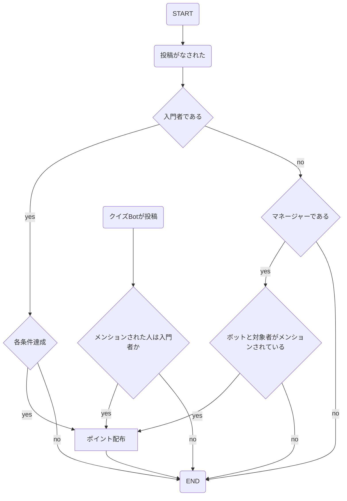
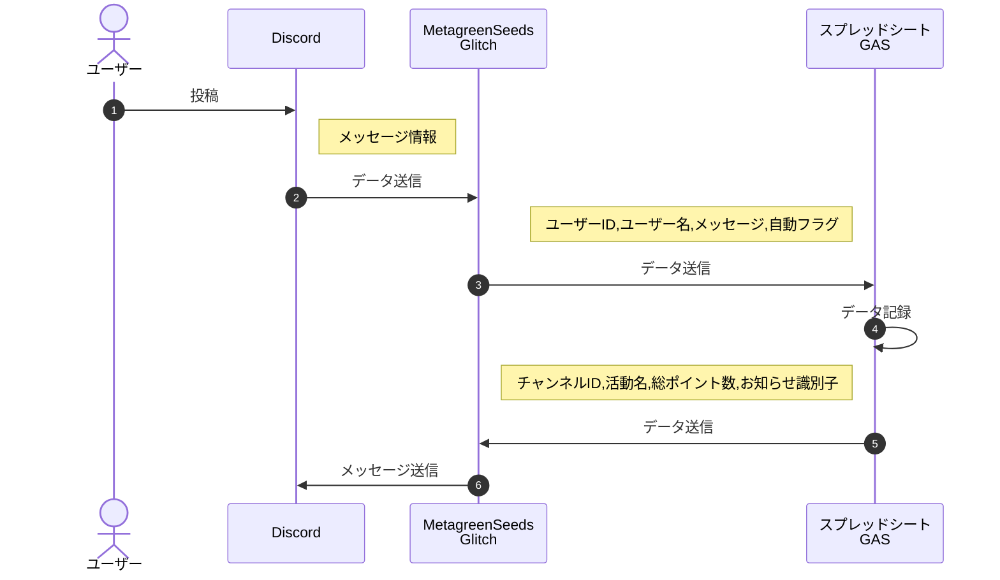

### 作成目的

MetaGreenSeedsプログラムに基づき自動化可能箇所を開発する

### 機能説明

各条件ごとにポイントを配布する

### 仕様

- 配布対象は入門者（Metagri_Hopeful）
- マネージャーはMetagri会員※インターン生の配布権限も追加（2024/10/4）
- 配布除外者であれば、ポイントを配布しない
- マネージャーがbotと対象者をメンションし、「（数）ポイント」と入力すると対象者に（数）ポイントが配布される。メンションでの配布は活動名自動配布定義外とし週間配布に記録される。※インターン生のロールも追加
- 特定のBot（クイズBot）が、指定のチャンネルで対象者をメンションすると、対象者に1ポイントが配布される。このポイントは「クイズ正解」として日間配布に記録される。
- 毎日18:00に活動シートを集計・リセット・ログシートに記録し、内容と合計ポイントが送信される。
    - 週間配布の活動のポイント配布は水曜日に行われる。（オフ会やセミナーは主に土日に行われ、それに関する投稿をその日中に行ったと仮定して、水曜日までその話題が続くとは考えられないから）
    - 定義外配布は毎週金曜日の18時に配布
- 10、30、60、100ポイントをオーバーするごとに１回お知らせのメッセージが送信される。
- 活動内容シートで変更可能箇所
- 活動名
- ポイント数
- 配布周期
- 正規表現
- 注意点
    - ユーザーが多くなると、GASの実行時間をオーバーする可能性あがある
    - ユーザー情報の削除は「行を削除」から行ってください

### フローチャート

### 活動一覧

| No. | 活動名 | ポイント数 | ポイント配布周期（日） | 正規表現 |
| --- | --- | --- | --- | --- |
| 0 | 挨拶投稿 | 1 | 1 |  |
| 1 | 雑談返信 | 1 | 1 |  |
| 2 | メシ投稿 | 2 | 1 |  |
| 3 | メシ返信 | 1 | 1 |  |
| 4 | ニュース投稿 | 2 | 1 | https:// |
| 5 | ニュース返信 | 1 | 1 |  |
| 6 | 書評投稿 | 2 | 1 | https:// |
| 7 | 書評返信 | 1 | 1 |  |
| 8 | SNS投稿 | 1 | 1 | https:// |
| 9 | セミナー感想投稿 | 5 | 7 |  |
| 10 | オフ会参加 | 10 | 7 |  |
| 11 | ボイスチャット参加 | 3 | 1 |  |
| 12 | 初回参加 | 1 | 0 |  |
| 13 | 自己紹介投稿 | 3 | 0 |  |
| 14 | メタバースプレイ | 3 | 1 | |
| 15 | クイズ正解 | 1 | 1 | |

### 配布除外者リスト

| ユーザーID | ユーザー名 |
| --- | --- |
|  |  |

### メンバー一覧

| ユーザーID | ユーザー名 | 合計ポイント | 30% | 60% | 100% |
| --- | --- | --- | --- | --- | --- |
|  |  |  |  |  |  |

### 日間配布

| ユーザーID | ユーザー名 | 活動名 | ポイント | 日時 |
| --- | --- | --- | --- | --- |
|  |  |  |  |  |

### 週間配布

| ユーザーID | ユーザー名 | 活動名 | ポイント | 日時 |
| --- | --- | --- | --- | --- |
|  |  |  |  |  |

### 定義外※毎週金曜日の18時に配布

| ユーザーID | ユーザー名 | ポイント | 日時 | メモ（配布メッセージ） |
| --- | --- | --- | --- | --- |
|  |  |  |  |  |

### 配布ログ

| ユーザーID | ユーザー名 | 活動名 | ポイント | 日時 |
| --- | --- | --- | --- | --- |
|  |  |  |  |  |

### 初回参加

| ユーザーID | ユーザー名 | 日時 |
| --- | --- | --- |
|  |  |  |

### 自己紹介投稿

| ユーザーID | ユーザー名 | 日時 |
| --- | --- | --- |
|  |  |  |

### 対応事項

1. Bot やサーバーの作成 [こちら](https://note.com/exteoi/n/nf1c37cb26c41)を参考に作成してください。
2. GAS
- GAS の作成
    - code.gs の内容を転記
    - プロジェクトの設定：プロジェクトの設定ー＞スクリプトプロパティのプロパティに GLITCH_URL、値に Glitch の Share ー＞ Project links の Link site をコピーしたものを貼り付けてください。
    - トリガーの設定：トリガーー＞トリガーの追加ー＞実行する関数を retainGlitch、イベントのソースを選択を時間主導型、時間ベースのトリガーのタイプを選択を分ベースのタイマー、時間の間隔を選択（分）を５分おきに設定してください。
    - デプロイ：デプロイー＞新しいデプロイを作成ー＞ウェブアプリを自分、アクセスできるユーザを全員に設定してください。
1. Glitch
- .env ファイルへの記載
    - DISCORD_BOT_TOKEN：BOTのTOKENを記載してください。
    - GAS_API_URL：.GAS で取得したAPIキーを記載してください。
    - GUILD_ID：サーバーのIDを記載してください。
    - MSG_SEND_CHANNEL_ID：配布メッセージを送るチャンネルIDを記載してください。
    - PER_30_ROLE_ID：30%offのメッセージが書かれたチャンネルを記載してください。
    - PER_60_ROLE_ID：60%offのメッセージが書かれたチャンネルを記載してください。
    - PER_100_ROLE_ID：100%offのメッセージが書かれたチャンネルを記載してください。
    - PER_30_URL：30%offのメッセージが書かれたチャンネルのリンクを記載してください。
    - PER_60_URL60%offのメッセージが書かれたチャンネルのリンクを記載してください。
    - PER_100_URL：100%offのメッセージが書かれたチャンネルのリンクを記載してください。
    - GREETING_CHANNEL_ID：挨拶投稿のチャンネルIDを記載してください。
    - TALK_CHANNEL_ID：雑談返信のチャンネルIDを記載してください。
    - FOOD_CHANNEL_ID：メシ投稿・メシ返信のチャンネルIDを記載してください。
    - NEWS_CHANNEL_ID：ニュース投稿・ニュース返信のチャンネルIDを記載してください。
    - BOOK_CHANNEL_ID：書評投稿・書評返信のチャンネルIDを記載してください。
    - SNS_CHANNEL_ID：SNS投稿のチャンネルIDを記載してください。
    - SEMINAR_CHANNEL_ID：セミナー感想投稿のチャンネルIDを記載してください。
    - OFF_LINE_MEETING_CHANNEL_ID：オフ会参加のチャンネルIDを記載してください。
    - VOICE_CHANNEL_ID：ボイスチャット30分参加のチャンネルIDを記載してください。
    - BIGNER_ROLE_ID：Metagri＿HopefulロールのIDを記載してください。
    - MANAGER_ID：マネージャーロールのIDを記載してください。
    - BOT_ID：BOTのIDを記載してください。
    - SELF_INTRODUCTION_CHANNEL_ID：自己紹介投稿のチャンネルIDを記載してください。
    - QUIZ_USER_ID：クイズポイントを配布する権限を持つBotのユーザーIDを記載してください。
    - NFT_ROLE_ID：10pt達成で付与するロールのID
    - PER_10_URL：10pt達成時に案内するDiscordチャンネル/メッセージのURL
