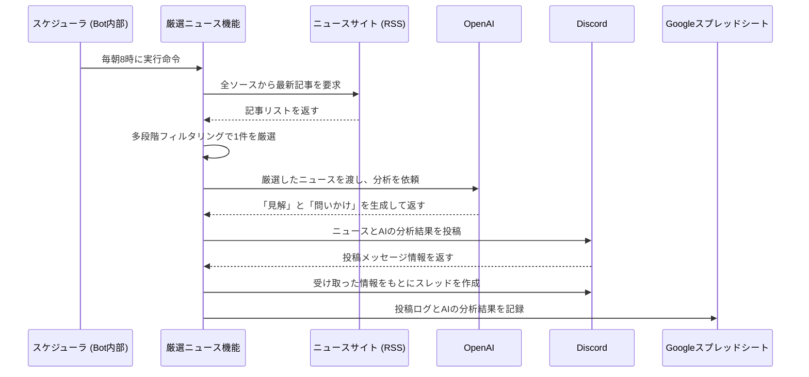
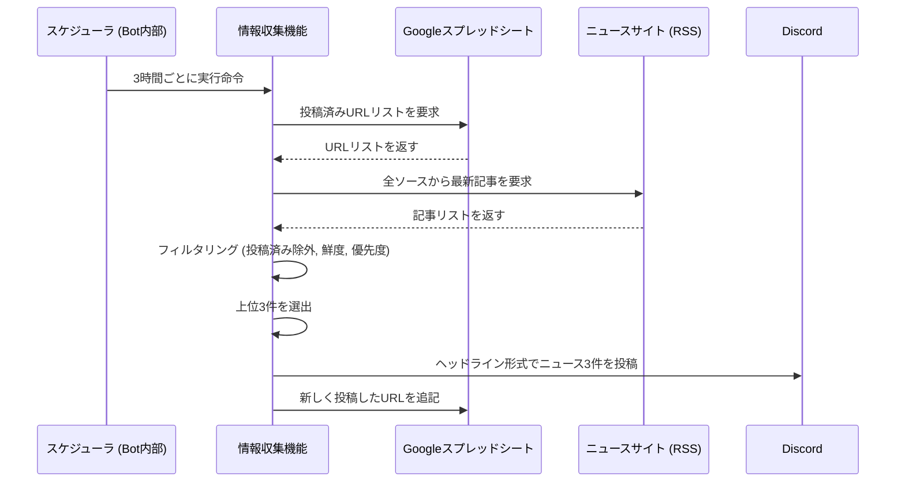
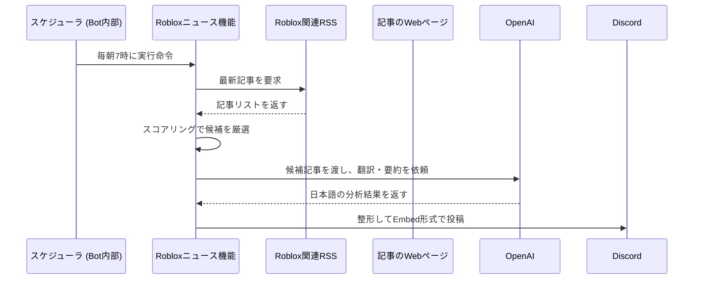
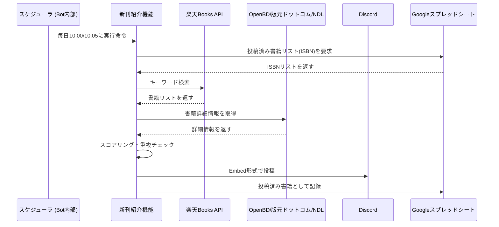
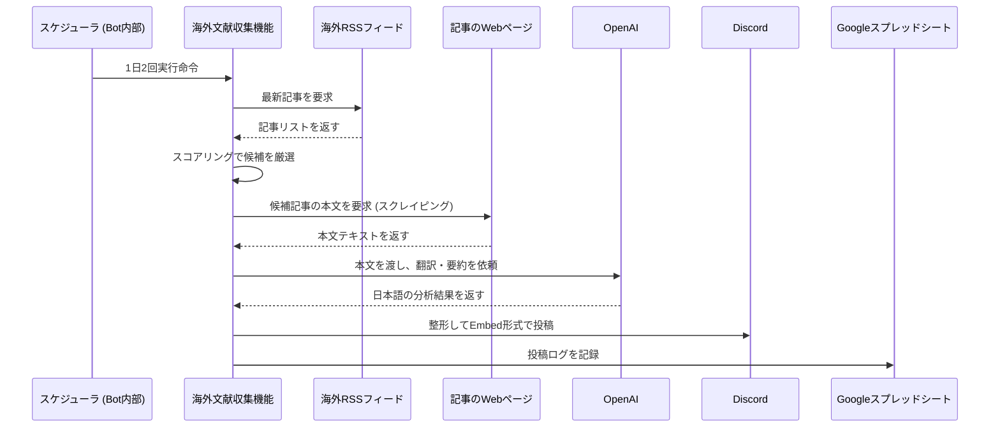
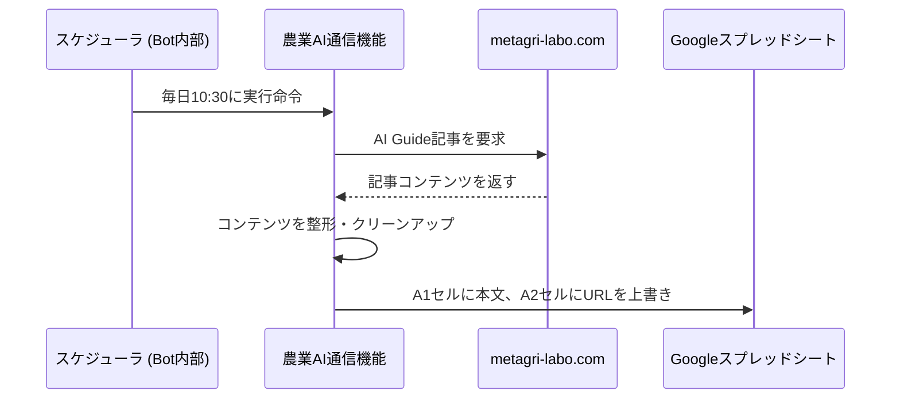
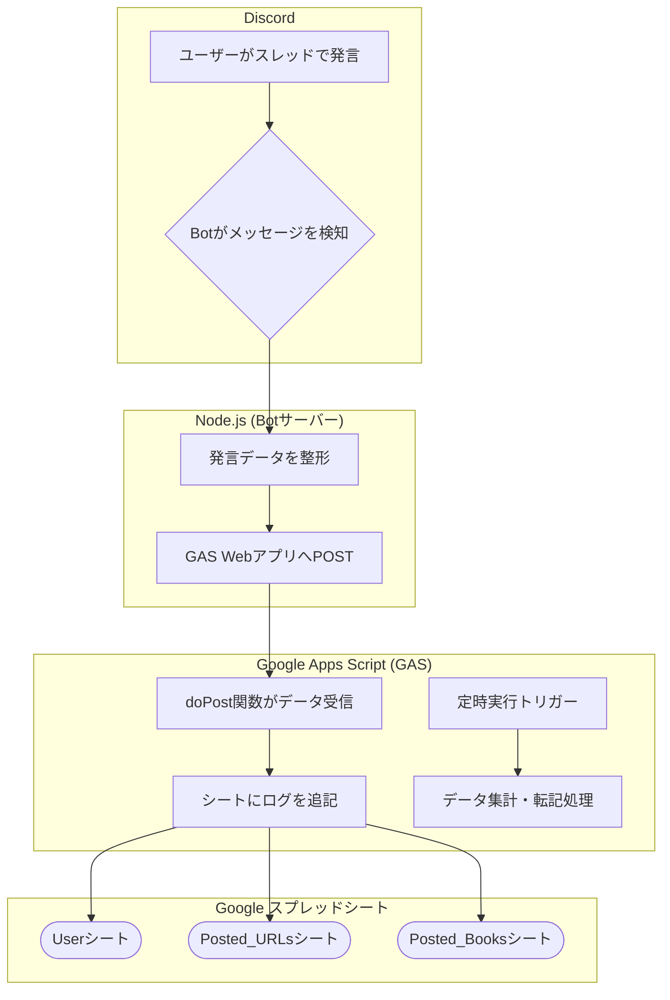

# Daily News Bot for Discord

## 概要 (Overview)

このBotは、AIによるインテリジェントなニュース分析機能と、コミュニティの活動を自動で記録するロギング機能を備えた高機能Botです。単なる情報配信に留まらず、コミュニティの対話を活性化させ、その知見を資産として蓄積することを目指します。

### 主要機能一覧

| 機能 | 実行時間 | 概要 |
|------|---------|------|
| **AI研究員による厳選ニュース** | 毎日 8:00 | 国内ニュースから1件選出、GPT-4oが「見解」と「問いかけ」を生成 |
| **国内情報収集ヘッドライン** | 6:00-18:00 (3時間毎) | スコアリング方式で関連性の高いニュース最大3件を選出 |
| **Robloxビジネス速報** | 毎日 7:00 | Roblox関連の英語ニュースをAI翻訳・要約 |
| **農業・Web3関連 新刊紹介** | 毎日 10:00 | 楽天Books APIで新刊検索、スコアリングで選出して投稿 |
| **一般書 新刊紹介** | 毎日 10:05 | 小説・ビジネス書の新刊を紹介 |
| **海外文献ダイジェスト** | 毎日 10:10 & 19:10 | 英語文献をスクレイピング→AIが日本語翻訳・要約 |
| **農業AI通信** | 毎日 10:30 | metagri-labo.comのAI Guide記事をGoogle Sheetsに転記 |
| **活動ログの自動記録** | リアルタイム | スレッド内の発言をGoogleスプレッドシートに自動記録 |

---

## 主な機能 (Features)

- **AIによるニュース分析・翻訳・要約**: GPT-4oを活用し、国内ニュースへの「見解」付与や、海外の英語文献の高度な日本語要約を自動生成
- **高度なスコアリング方式**: 複数のキーワードカテゴリ（技術、消費者体験、社会課題など）に基づいてニュースを点数付けし、コミュニティの関心に合致した情報を高精度で選出
- **動的スコアリング**: 過去の議論データを学習し、コミュニティの反応が良かった記事のキーワードパターンにボーナスを付与
- **重複記事検出**: レーベンシュタイン距離アルゴリズムでタイトル類似度を計算し、類似記事を自動統合
- **コンテキスト分析**: 過去7日間のニューストレンドを分析し、AI分析時のコンテキストとして活用
- **Webスクレイピング**: RSSフィードに概要がない場合でも、記事のWebページから直接本文を取得
- **複数書籍API統合**: 楽天Books、OpenBD、版元ドットコム、国立国会図書館、Google Books APIを連携
- **重複投稿防止**: URL/ISBNキャッシュで一度投稿したニュース・書籍を再度投稿しない
- **Googleスプレッドシート連携**: Google Apps Script (GAS) をWebアプリとして利用し、活動データをリアルタイムに記録
- **ユーザーロール判定**: 議論に参加したユーザーが特定のロールを持っているかを判定し、ログに記録
- **自動デプロイ**: GitHubのmainブランチへのプッシュをトリガーに、GitHub ActionsがDockerコンテナを自動でビルド＆デプロイ

---

## 機能の仕組み

### 1. AI研究員による厳選ニュース配信 (毎日 AM 8:00)

AIがファシリテーターとなり、コミュニティでの質の高い議論を創出します。



### 2. 情報収集ヘッドライン (AM 6:00 - PM 18:00 / 3時間ごと)

個人の情報収集をサポートするため、幅広いニュースソースから関連性の高い最新ニュースを最大3件、重複なく届け続けます。



### 3. Robloxビジネス・アップデート速報 (毎日 AM 7:00)

収集からAI分析、投稿までを自動化し、Robloxのビジネス動向を効率的にキャッチアップします。



### 4. 新刊紹介 (毎日 AM 10:00 & 10:05)

農業・Web3関連の専門書と一般書の新刊を自動で紹介します。



### 5. 海外文献ダイジェスト (毎日 AM 10:10 & PM 19:10)

収集、フィルタリング、スクレイピング、AI分析という多段階のプロセスを経て、世界の最先端情報を届けます。



### 6. 農業AI通信 (毎日 AM 10:30)

metagri-labo.comのAI Guide記事を取得し、Google Sheetsに転記します。



---

## ニュース選定ロジックの詳細 (Scoring Logic Details)

### 1. 国内情報収集ヘッドラインのスコアリング

**目的**: コミュニティの関心（ヒト、体験、社会課題など）を多角的に評価し、議論のきっかけとなりやすい多様なニュースを選出する。

**処理フロー**:

1. **【必須条件】**: 記事に`CORE_AGRI_KEYWORDS`（`'農業'`, `'農家'`など）が1つでも含まれているかをチェック。含まれていない場合は除外。

2. **【カテゴリ別スコアリング】**: 以下のカテゴリに合致するキーワードが含まれていれば点数を加算。

| カテゴリ | 点数 | キーワード例 |
|---------|------|------------|
| 技術革新 | +5点 | AI, Web3, IoT, ドローン, ロボット |
| 消費者体験・6次産業化 | +5点 | ブランド, 体験, 農泊 |
| ヒト・人材・ストーリー | +4点 | 就農, 脱サラ, 後継者 |
| 社会課題・サステナビリティ | +4点 | 食料危機, 人手不足, SDGs |
| ビジネス・政策・制度 | +3点 | 農業経営, GAP, 補助金 |
| コア農業・一次産業 | +2点 | 農業, 農家, 栽培 (基礎点) |
| ボーナス・バズワード | +2点 | 提携, 実証実験 |

3. **【シナジーボーナス】**: 特定カテゴリの組み合わせにボーナス点を加算。
   - `コア農業` + `技術革新` → **+10点**
   - `コア農業` + `消費者体験` → **+8点**

4. **【動的スコアリング】**: 過去の議論データに基づいてボーナスを付与。
   - 投稿数10件以上の記事のキーワード: +20%
   - 投稿数5-9件: +15%
   - 投稿数3-4件: +10%
   - 長文コメント（平均200文字以上）: 追加で+10%

5. **【最終選定】**: スコアの高い順に並べ替え、上位3件を選出。

### 2. 海外文献ダイジェストのスコアリング

**目的**: AgriTech（農業×技術）分野の重要文献を最優先で選出。

| カテゴリ | 点数 | キーワード例 |
|---------|------|------------|
| 農業キーワード (必須) | +5点 | agriculture, farming, agritech |
| 技術キーワード | +5点 | AI, blockchain, IoT, drone |
| 研究キーワード | +3点 | research, study, findings |

**Agri-Techシナジーボーナス**: `農業` + `技術` → **+10点** (最優先)

### 3. Robloxニュースのスコアリング

| カテゴリ | 点数 | キーワード例 |
|---------|------|------------|
| ビジネス/ブランド活用 | +5点 | partnership, brand, virtual store |
| プラットフォームアップデート | +5点 | update, feature, engine, studio |
| 財務/市場動向 | +4点 | earnings, revenue, stock |
| 技術/イノベーション | +3点 | AI, metaverse, VR |

スコア4点未満の記事は除外、上位最大5件を選出。

---

## 高度な重複記事検出システム

**概要**: タイトルの類似度を計算し、重複または類似記事を自動検出・除外します。

**仕組み**:
- レーベンシュタイン距離アルゴリズムで文字列の類似度を測定
- タイトルが70%以上類似している記事を自動検出
- 類似記事グループの中で最もスコアの高い記事のみを残す

**例**:
```
記事A: 「AI農業ロボット、北海道で実証実験開始」
記事B: 「AI農業ロボットが北海道で実証実験」
→ 類似度: 85% → 重複として検出
```

---

## 使用技術 (Technology Stack)

### バックエンド・ランタイム
- **Node.js** v20（Dockerで実行）
- **npm**（パッケージ管理）

### 主要ライブラリ

| ライブラリ | バージョン | 用途 |
|-----------|-----------|------|
| discord.js | ^14.21.0 | Discord Bot実装 |
| axios | ^1.11.0 | HTTP通信 |
| rss-parser | ^3.13.0 | RSSフィード解析 |
| cheerio | ^1.1.2 | Webスクレイピング |
| node-cron | ^4.2.1 | スケジュール処理 |
| openai | ^5.15.0 | GPT-4o API呼び出し |
| dotenv | ^17.2.1 | 環境変数読み込み |

### 外部API

| API | 用途 |
|-----|------|
| OpenAI API (GPT-4o) | ニュース分析、翻訳・要約生成 |
| Google Apps Script WebApp | Google Sheets連携、ログ記録 |
| 楽天Books API | 新刊検索 |
| OpenBD API | 書籍詳細情報取得 |
| 版元ドットコム API | 書籍情報補完 |
| 国立国会図書館 API | 書籍情報検索 |
| Google Books API | 書籍情報補完 |

### インフラストラクチャ
- **Docker**: コンテナ化
- **Docker Compose**: オーケストレーション
- **GitHub Actions**: CI/CD自動デプロイ
- **SSH**: リモートサーバーへのデプロイ

---

## 導入・セットアップ方法 (Setup)

### Part 1: Discord Bot & OpenAI APIの準備

1. **Botの作成**: [Discord Developer Portal](https://discord.com/developers/applications)でアプリケーションとBotを作成し、**Botトークン**をコピー。
2. **Message Content Intentの有効化**: Developer Portalの`Bot`ページで「**MESSAGE CONTENT INTENT**」を**必ず有効**にしてください。
3. **Botの招待**: `OAuth2` > `URL Generator`で、スコープに`bot`を選択し、必要な権限にチェックを入れてサーバーに招待。
   - 必要な権限: `Send Messages`, `Create Public Threads`, `Embed Links`, `Read Message History`
4. **OpenAI APIキーの取得**: [OpenAI Platform](https://platform.openai.com/)でアカウントを作成し、**APIキー**を取得。

### Part 2: Google Apps Script (GAS) の準備

詳細は [GAS_INTEGRATION.md](GAS_INTEGRATION.md) を参照してください。

1. **スプレッドシートの作成**: ログ記録用の新しいGoogleスプレッドシートを作成。
2. **GASの設定**: スプレッドシートのメニュー `[拡張機能]` > `[Apps Script]` を選択し、`Code.gs` のコードを貼り付け。
3. **Webアプリとしてデプロイ**: `アクセスできるユーザー:` を「**全員**」に変更し、デプロイ。

### Part 3: プロジェクトのセットアップ

1. **リポジトリをクローンし、ライブラリをインストール**
    ```bash
    git clone https://github.com/Metagri-Bot/daily-news-bot.git
    cd daily-news-bot
    npm install
    ```

2. **`.env`ファイルを作成**
    `.env.sample`をコピーして`.env`ファイルを作成し、必要な環境変数を設定。

### 環境変数一覧

| 変数名 | 説明 |
|--------|------|
| `DISCORD_BOT_TOKEN` | Discord Botトークン |
| `NEWS_CHANNEL_ID` | 厳選ニュース投稿先チャンネルID |
| `INFO_GATHERING_CHANNEL_ID` | 情報収集ヘッドライン投稿先 |
| `GLOBAL_RESEARCH_CHANNEL_ID` | 海外文献投稿先 |
| `ROBLOX_NEWS_CHANNEL_ID` | Robloxニュース投稿先 |
| `NEW_BOOK_CHANNEL_ID` | 農業・Web3新刊投稿先 |
| `POPULAR_BOOK_CHANNEL_ID` | 一般書新刊投稿先 |
| `OPENAI_API_KEY` | OpenAI APIキー |
| `GOOGLE_APPS_SCRIPT_URL` | GAS WebアプリURL |
| `AI_GUIDE_GAS_URL` | 農業AI通信専用GAS URL |
| `BIGNER_ROLE_ID` | Bigner ロールID |
| `METAGRI_ROLE_ID` | Metagri ロールID |
| `NEWS_RSS_FEEDS_AGRICULTURE` | 農業関連RSS (カンマ区切り) |
| `NEWS_RSS_FEEDS_WEB3` | Web3関連RSS |
| `GLOBAL_RSS_FEEDS` | 海外文献RSS |
| `ROBLOX_RSS_FEEDS` | Roblox関連RSS |
| `RAKUTEN_APP_ID` | 楽天Books API ID |

---

## デプロイ方法 (Deployment)

`main`ブランチにプッシュすると、GitHub Actionsが自動でサーバーにデプロイします。

### 必要なGitHub Secrets

リポジトリの`Settings` > `Secrets and variables` > `Actions`に以下を登録:

- `SSH_HOST`, `SSH_USER`, `SSH_PRIVATE_KEY`
- 上記環境変数一覧に記載したすべての変数

---

## 使い方とカスタマイズ

| カスタマイズ項目 | 方法 |
|----------------|------|
| 投稿時間の変更 | `index.js`内の`cron.schedule(...)`の書式を変更 |
| AIプロンプトの変更 | `index.js`内の`generateMetagriInsight`関数のプロンプトを編集 |
| スコアの調整 | `index.js`上部のキーワードカテゴリ定義エリアで点数を変更 |
| キーワードの変更 | `CORE_AGRI_KEYWORDS`などのキーワード配列を編集 |
| ニュースソースの変更 | `.env`ファイルの`NEWS_RSS_FEEDS_...`の値を変更 |

---

## Googleスプレッドシート連携の詳細

### GASが管理するシート

| シート名 | 用途 |
|---------|------|
| `User` | スレッド内の全発言を記録 |
| `News` | 厳選ニュースの履歴を記録 |
| `Posted_URLs` | 投稿済みニュースURL（重複防止） |
| `Posted_Books` | 投稿済み書籍ISBN（重複防止） |
| `Global_Research` | 海外文献ダイジェストの履歴 |

### データの流れ



---

## ファイル構成

```
daily-news-bot/
├── index.js              # メインプログラム
├── Code.gs               # GAS (新刊・ニュースログ管理)
├── AIGuideCode.gs        # GAS (農業AI通信記録)
├── package.json          # npm依存関係
├── dockerfile            # Docker設定
├── compose.yaml          # Docker Compose設定
├── .env.sample           # 環境変数テンプレート
├── README.md             # 本ドキュメント
├── GAS_INTEGRATION.md    # GAS連携ガイド
└── .github/
    └── workflows/
        └── deploy.yml    # CI/CD設定
```

---

## スケジュール一覧

| 時刻 | タスク | Cron式 |
|------|--------|--------|
| 6:00 | 情報収集ヘッドライン | `0 6 * * *` |
| 7:00 | Robloxビジネス速報 | `0 7 * * *` |
| 8:00 | AI研究員厳選ニュース | `0 8 * * *` |
| 9:00 | 情報収集ヘッドライン | `0 9 * * *` |
| 10:00 | 農業・Web3新刊紹介 | `0 10 * * *` |
| 10:05 | 一般書新刊紹介 | `5 10 * * *` |
| 10:10 | 海外文献ダイジェスト | `10 10 * * *` |
| 10:30 | 農業AI通信 | `30 10 * * *` |
| 12:00 | 情報収集ヘッドライン | `0 12 * * *` |
| 15:00 | 情報収集ヘッドライン | `0 15 * * *` |
| 18:00 | 情報収集ヘッドライン | `0 18 * * *` |
| 19:10 | 海外文献ダイジェスト | `10 19 * * *` |

---

## ライセンス (License)

このプロジェクトは [MIT License](LICENSE) の下で公開されています。
