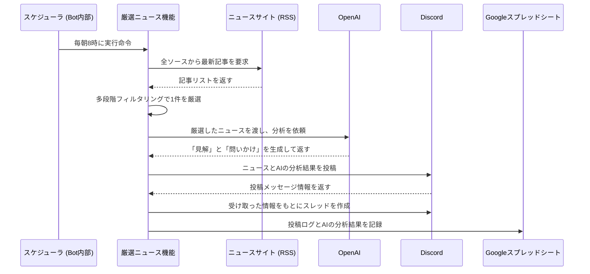
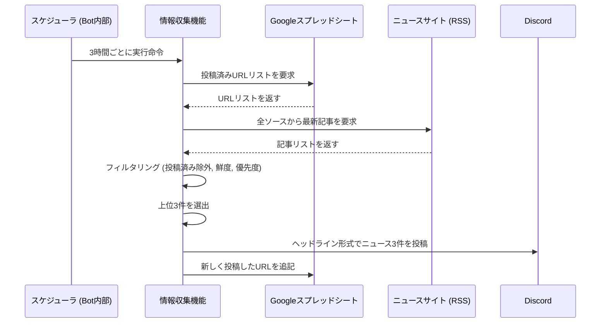
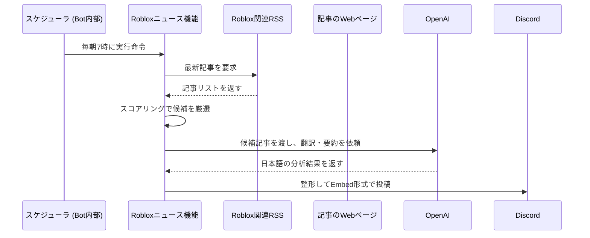
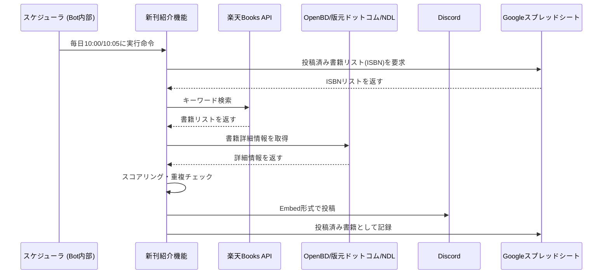
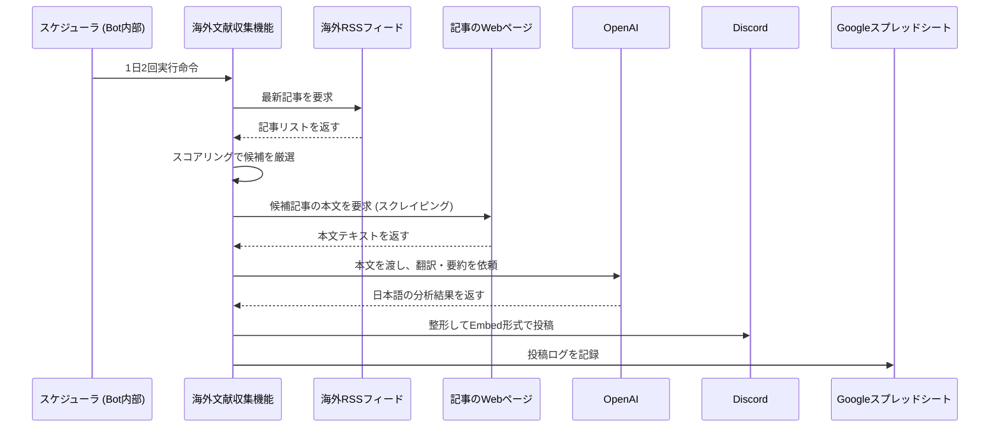
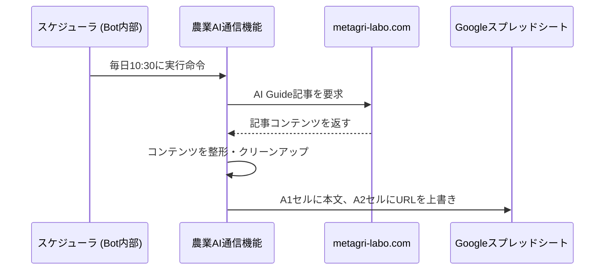
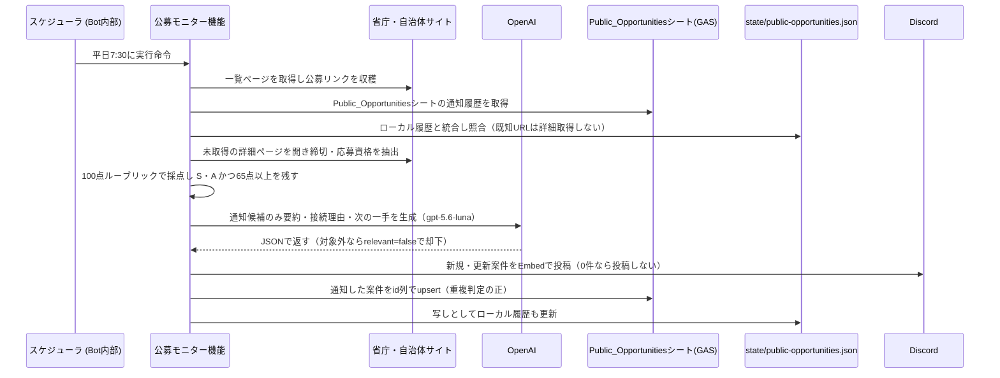
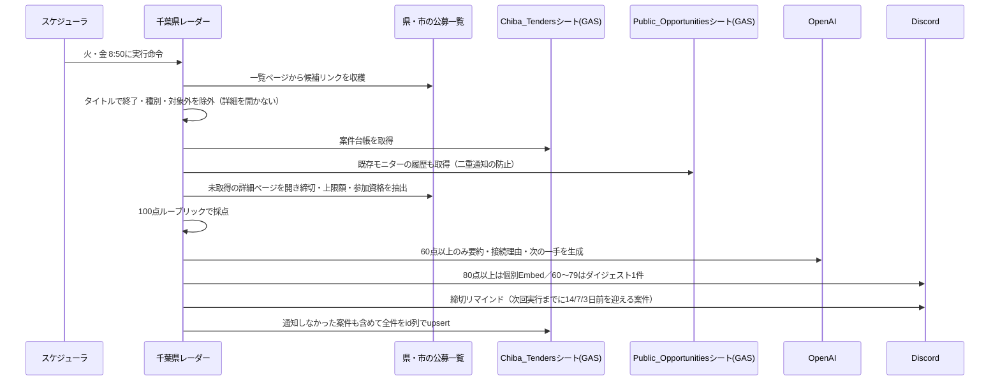
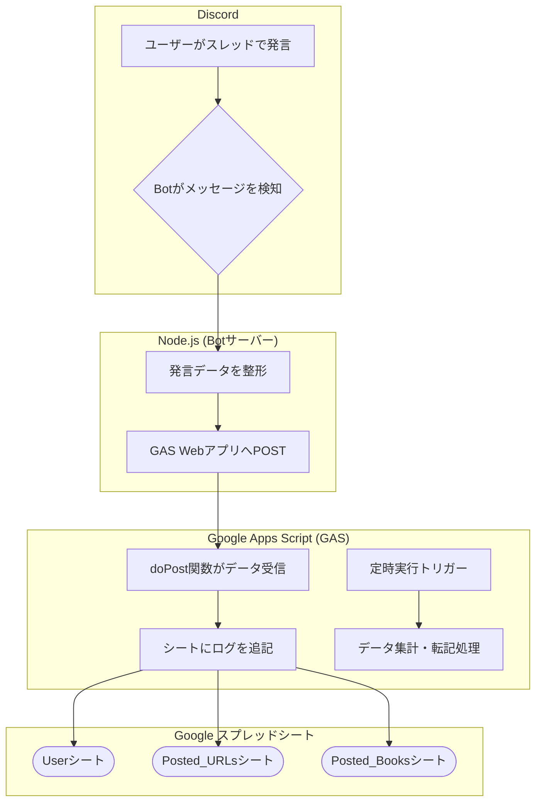

# Daily News Bot for Discord

## 概要 (Overview)

このBotは、AIによるインテリジェントなニュース分析機能と、コミュニティの活動を自動で記録するロギング機能を備えた高機能Botです。単なる情報配信に留まらず、コミュニティの対話を活性化させ、その知見を資産として蓄積することを目指します。

### 主要機能一覧

| 機能 | 実行時間 | 概要 |
|------|---------|------|
| **AI研究員による厳選ニュース** | 毎日 8:00 | 7日以内の国内ニュースから1件選出、GPT-4oが「見解」と「問いかけ」を生成 |
| **国内情報収集ヘッドライン** | 6:00-18:00 (3時間毎) | 7日以内の記事を対象に、関連性の高いニュース最大3件を選出 |
| **Robloxビジネス速報** | 毎日 7:00 | 7日以内のRoblox関連英語ニュースをAI翻訳・要約 |
| **農業・Web3関連 新刊紹介** | 毎日 10:00 | 楽天Books APIで新刊検索、スコアリングで選出して投稿 |
| **一般書 新刊紹介** | 毎日 10:05 | 小説・ビジネス書の新刊を紹介 |
| **海外文献ダイジェスト** | 毎日 10:10 & 19:10 | 7日以内の英語文献をスクレイピング→AIが日本語翻訳・要約 |
| **農業AI通信** | 毎日 10:30 | metagri-labo.comのAI Guide記事をGoogle Sheetsに転記 |
| **官公庁・自治体 公募モニター** | 平日 7:30 | 省庁・自治体の公募を収集し、農情人との親和性を100点評価してS・Aランクのみ通知 |
| **千葉県自治体案件レーダー** | 火・金 8:50 | 千葉県＋近隣6市の企画提案（プロポーザル）を収集し、100点評価して通知＋締切リマインド |
| **活動ログの自動記録** | リアルタイム | スレッド内の発言をGoogleスプレッドシートに自動記録 |

---

## 主な機能 (Features)

- **AIによるニュース分析・翻訳・要約**: GPT-4oを活用し、国内ニュースへの「見解」付与や、海外の英語文献の高度な日本語要約を自動生成
- **高度なスコアリング方式**: 複数のキーワードカテゴリ（技術、消費者体験、社会課題など）に基づいてニュースを点数付けし、コミュニティの関心に合致した情報を高精度で選出
- **農家AI活用事例の優先通知**: 農家・生産者などがAIを実際に活用した記事を専用判定し、該当日にはヘッドライン内の1枠を確保
- **ニュース鮮度の統一**: Daily Insight、国内ヘッドライン、Roblox速報、海外文献は公開日時が実行時点から7日以内の記事だけを対象化
- **動的スコアリング**: 過去の議論データを学習し、コミュニティの反応が良かった記事のキーワードパターンにボーナスを付与
- **重複記事検出**: レーベンシュタイン距離アルゴリズムでタイトル類似度を計算し、類似記事を自動統合
- **コンテキスト分析**: 過去7日間のニューストレンドを分析し、AI分析時のコンテキストとして活用
- **Webスクレイピング**: RSSフィードに概要がない場合でも、記事のWebページから直接本文を取得
- **複数書籍API統合**: 楽天Books、OpenBD、版元ドットコム、国立国会図書館、Google Books APIを連携
- **重複投稿防止**: URL/ISBNキャッシュで一度投稿したニュース・書籍を再度投稿しない
- **Googleスプレッドシート連携**: Google Apps Script (GAS) をWebアプリとして利用し、活動データをリアルタイムに記録
- **ユーザーロール判定**: 議論に参加したユーザーが特定のロールを持っているかを判定し、ログに記録
- **自動デプロイ**: GitHubのmainブランチへのプッシュをトリガーに、GitHub ActionsがDockerコンテナを自動でビルド＆デプロイ

---

## 機能の仕組み

### 1. AI研究員による厳選ニュース配信 (毎日 AM 8:00)

AIがファシリテーターとなり、コミュニティでの質の高い議論を創出します。


```mermaid
sequenceDiagram
    participant Scheduler as スケジューラ (Bot内部)
    participant DailyNewsTask as 厳選ニュース機能
    participant NewsSites as ニュースサイト (RSS)
    participant OpenAI
    participant Discord
    participant GoogleSheets as Googleスプレッドシート

    Scheduler->>DailyNewsTask: 毎朝8時に実行命令
    DailyNewsTask->>NewsSites: 全ソースから最新記事を要求
    NewsSites-->>DailyNewsTask: 記事リストを返す
    DailyNewsTask->>DailyNewsTask: 多段階フィルタリングで1件を厳選
    DailyNewsTask->>OpenAI: 厳選したニュースを渡し、分析を依頼
    OpenAI-->>DailyNewsTask: 「見解」と「問いかけ」を生成して返す
    DailyNewsTask->>Discord: ニュースとAIの分析結果を投稿
    Discord-->>DailyNewsTask: 投稿メッセージ情報を返す
    DailyNewsTask->>Discord: 受け取った情報をもとにスレッドを作成
    DailyNewsTask->>GoogleSheets: 投稿ログとAIの分析結果を記録
```

### 2. 情報収集ヘッドライン (AM 6:00 - PM 18:00 / 3時間ごと)

個人の情報収集をサポートするため、幅広いニュースソースから関連性の高い最新ニュースを最大3件、重複なく届け続けます。


```mermaid
sequenceDiagram
    participant Scheduler as スケジューラ (Bot内部)
    participant InfoGatheringTask as 情報収集機能
    participant GoogleSheets as Googleスプレッドシート
    participant NewsSites as ニュースサイト (RSS)
    participant Discord

    Scheduler->>InfoGatheringTask: 3時間ごとに実行命令
    InfoGatheringTask->>GoogleSheets: 投稿済みURLリストを要求
    GoogleSheets-->>InfoGatheringTask: URLリストを返す
    InfoGatheringTask->>NewsSites: 全ソースから最新記事を要求
    NewsSites-->>InfoGatheringTask: 記事リストを返す
    InfoGatheringTask->>InfoGatheringTask: フィルタリング (投稿済み除外, 鮮度, 優先度)
    InfoGatheringTask->>InfoGatheringTask: 上位3件を選出
    InfoGatheringTask->>Discord: ヘッドライン形式でニュース3件を投稿
    InfoGatheringTask->>GoogleSheets: 新しく投稿したURLを追記
```

### 3. Robloxビジネス・アップデート速報 (毎日 AM 7:00)

収集からAI分析、投稿までを自動化し、Robloxのビジネス動向を効率的にキャッチアップします。


```mermaid
sequenceDiagram
    participant Scheduler as スケジューラ (Bot内部)
    participant RobloxTask as Robloxニュース機能
    participant NewsSites as Roblox関連RSS
    participant WebPage as 記事のWebページ
    participant OpenAI
    participant Discord

    Scheduler->>RobloxTask: 毎朝7時に実行命令
    RobloxTask->>NewsSites: 最新記事を要求
    NewsSites-->>RobloxTask: 記事リストを返す
    RobloxTask->>RobloxTask: スコアリングで候補を厳選
    RobloxTask->>OpenAI: 候補記事を渡し、翻訳・要約を依頼
    OpenAI-->>RobloxTask: 日本語の分析結果を返す
    RobloxTask->>Discord: 整形してEmbed形式で投稿
```

### 4. 新刊紹介 (毎日 AM 10:00 & 10:05)

農業・Web3関連の専門書と一般書の新刊を自動で紹介します。


```mermaid
sequenceDiagram
    participant Scheduler as スケジューラ (Bot内部)
    participant BookTask as 新刊紹介機能
    participant RakutenAPI as 楽天Books API
    participant BookAPIs as OpenBD/版元ドットコム/NDL
    participant Discord
    participant GoogleSheets as Googleスプレッドシート

    Scheduler->>BookTask: 毎日10:00/10:05に実行命令
    BookTask->>GoogleSheets: 投稿済み書籍リスト(ISBN)を要求
    GoogleSheets-->>BookTask: ISBNリストを返す
    BookTask->>RakutenAPI: キーワード検索
    RakutenAPI-->>BookTask: 書籍リストを返す
    BookTask->>BookAPIs: 書籍詳細情報を取得
    BookAPIs-->>BookTask: 詳細情報を返す
    BookTask->>BookTask: スコアリング・重複チェック
    BookTask->>Discord: Embed形式で投稿
    BookTask->>GoogleSheets: 投稿済み書籍として記録
```

### 5. 海外文献ダイジェスト (毎日 AM 10:10 & PM 19:10)

収集、フィルタリング、スクレイピング、AI分析という多段階のプロセスを経て、世界の最先端情報を届けます。


```mermaid
sequenceDiagram
    participant Scheduler as スケジューラ (Bot内部)
    participant GlobalTask as 海外文献収集機能
    participant NewsSites as 海外RSSフィード
    participant WebPage as 記事のWebページ
    participant OpenAI
    participant Discord
    participant GoogleSheets as Googleスプレッドシート

    Scheduler->>GlobalTask: 1日2回実行命令
    GlobalTask->>NewsSites: 最新記事を要求
    NewsSites-->>GlobalTask: 記事リストを返す
    GlobalTask->>GlobalTask: スコアリングで候補を厳選
    GlobalTask->>WebPage: 候補記事の本文を要求 (スクレイピング)
    WebPage-->>GlobalTask: 本文テキストを返す
    GlobalTask->>OpenAI: 本文を渡し、翻訳・要約を依頼
    OpenAI-->>GlobalTask: 日本語の分析結果を返す
    GlobalTask->>Discord: 整形してEmbed形式で投稿
    GlobalTask->>GoogleSheets: 投稿ログを記録
```

### 6. 農業AI通信 (毎日 AM 10:30)

metagri-labo.comのAI Guide記事を取得し、Google Sheetsに転記します。


```mermaid
sequenceDiagram
    participant Scheduler as スケジューラ (Bot内部)
    participant AIGuideTask as 農業AI通信機能
    participant MetagriSite as metagri-labo.com
    participant GoogleSheets as Googleスプレッドシート

    Scheduler->>AIGuideTask: 毎日10:30に実行命令
    AIGuideTask->>MetagriSite: AI Guide記事を要求
    MetagriSite-->>AIGuideTask: 記事コンテンツを返す
    AIGuideTask->>AIGuideTask: コンテンツを整形・クリーンアップ
    AIGuideTask->>GoogleSheets: A1セルに本文、A2セルにURLを上書き
```

### 7. 官公庁・自治体 公募モニター (平日 AM 7:30)

農情人・Metagri研究所の事業と相性のよい公募案件を自動で探し、応募検討に値するものだけを通知します。


```mermaid
sequenceDiagram
    participant Scheduler as スケジューラ (Bot内部)
    participant Monitor as 公募モニター機能
    participant Gov as 省庁・自治体サイト
    participant OpenAI
    participant Sheet as Public_Opportunitiesシート(GAS)
    participant State as state/public-opportunities.json
    participant Discord

    Scheduler->>Monitor: 平日7:30に実行命令
    Monitor->>Gov: 一覧ページを取得し公募リンクを収穫
    Monitor->>Sheet: Public_Opportunitiesシートの通知履歴を取得
    Monitor->>State: ローカル履歴と統合し照合（既知URLは詳細取得しない）
    Monitor->>Gov: 未取得の詳細ページを開き締切・応募資格を抽出
    Monitor->>Monitor: 100点ルーブリックで採点し S・A かつ65点以上を残す
    Monitor->>OpenAI: 通知候補のみ要約・接続理由・次の一手を生成（gpt-5.6-luna）
    OpenAI-->>Monitor: JSONで返す（対象外ならrelevant=falseで却下）
    Monitor->>Discord: 新規・更新案件をEmbedで投稿（0件なら投稿しない）
    Monitor->>Sheet: 通知した案件をid列でupsert（重複判定の正）
    Monitor->>State: 写しとしてローカル履歴も更新
```

**採点ルーブリック（合計100点）**

| 評価軸 | 配点 | 見るポイント |
|---|---:|---|
| 事業テーマ適合 | 25点 | 農業・農村・地域とAI/web3/デジタルが直接交差しているか |
| スケール効果 | 20点 | 予算・広報・実装機会・パートナー接続を得られるか |
| 応募・参画可能性 | 15点 | 法人単独／コンソーシアム／自治体パートナーで参加できるか |
| 既存実績の転用 | 15点 | 白井市・農業AI調査・Metagri・登壇・開発実績を使えるか |
| 実行可能性 | 15点 | 締切までの余裕、自己負担、体制要件が現実的か |
| 緊急性・希少性 | 10点 | 締切までの日数と機会の希少性 |

- **S（80〜100点）**: 応募・説明会参加・主催者照会を優先 → 赤色のEmbedで通知
- **A（65〜79点）**: 条件確認またはパートナー探索へ → 橙色のEmbedで通知
- **B（50〜64点）/ C（49点以下）**: 通知しない

**通知しないもの**: 締切済み、採択結果ページ、一般競争入札・工事・物品調達、機械設備の購入のみを目的とした補助、応募資格が農業者・自治体・研究機関のみで企業の役割がないもの、公募告知でないページ。

**重複制御（3層）**

1. **同一性の判定**: 公式URLを正規化（`utm_*`・トラッキング・末尾スラッシュ・フラグメントを除去）したハッシュを案件IDとする
2. **再通知の判定**: 同じIDなら、締切を「時刻」として比較。締切が同じなら再通知しない（AIが生成するタイトルの揺れやセル書式の変換では再通知されない）。締切が変わった場合のみ「更新｜」付きで再通知
3. **履歴の保存先**: **Googleスプレッドシートの `Public_Opportunities` シートが正**。`state/public-opportunities.json` はその写し（キャッシュ）で、Dockerの名前付きボリューム `bot-state` にも保持

シートを正にしているため、コンテナ再作成・サーバー移行・ボリューム削除でも過去案件は再通知されません。実行時にシート履歴とローカル履歴を統合し、投稿後にシートへ追記（`id`列でupsert）します。

| 状況 | 挙動 |
|---|---|
| シート・ローカルともに読める | 統合して重複判定（通常） |
| GASが履歴APIに未対応（旧バージョン） | ローカルのみで判定を継続し、再デプロイを促す警告を出す |
| 通信失敗／ローカル履歴あり | ローカルのみで判定を継続し、警告ログを出す |
| 通信失敗／ローカル履歴も空 | **投稿せず中断**（過去案件の再通知を防ぐフェイルセーフ。監視Webhookへエラー通知） |
| シートへの追記に失敗 | 投稿は完了扱い。ローカル履歴のみ更新し、エラーログを出す |

⚠ **この機能を有効にするにはApps Scriptの再デプロイが必要です**（手順: `GAS_INTEGRATION.md`「公募モニターの履歴シート」）。未対応のままでもBotは動きますが、履歴はローカルのみになります。

Coworkスキル側（`Scheduled/public-opportunity-monitor`）も同じシートを参照するため、Botとスキルの二重通知も防げます（案件IDと署名の計算方法はBot・スキルで一致）。

**手動実行**

```bash
# Discordへ送らず内容だけ確認（履歴も更新しない）
node scripts/run-public-opportunity-once.js --dry-run

# 実際に投稿する
node scripts/run-public-opportunity-once.js

# 監視先URLの生存確認（省庁のページ改修時に実行）
node scripts/check-public-opportunity-sources.js

# モデルを一時的に変えて試す
node scripts/run-public-opportunity-once.js --dry-run --model gpt-5.6-terra
```

**AIモデル**: 既定は `gpt-5.6-luna`（低コスト・高スループット枠）。GPT-5系はreasoningトークンを使うため `temperature` を送らず `max_completion_tokens` と `reasoning_effort: low` で呼び出します。未対応パラメータで400が返った場合は最小構成で1回だけ自動再試行し、それでも失敗すればキーワード評価のみで投稿を継続します（通知は止めません）。

**監視先の追加・停止**: `public-opportunity-sources.js` を編集します。`enabled: false` で一時停止、`priority` で範囲を制御（1=国の主要機関、2=NEDO/IPA/中小機構等、3=自治体）。JグランツのようなJavaScript描画のサイトはBotでは取得できないため、`MANUAL_SOURCES` に記録し、Cowork側のスキル（`Scheduled/public-opportunity-monitor`）で人が確認します。

⚠ **`chiba-pref`（千葉県 報道発表一覧）は 2026-09-01 に `enabled: false` へ変更しました。** 千葉県は下記の専用モジュールへ移しています。`linkFilter` が `/^\//i` と極めて広いため、`true` に戻すと同じ千葉県案件が両方から通知されます。

---

### 8. 千葉県自治体案件レーダー (火・金 AM 8:50)

千葉県＋近隣6市の**企画提案（プロポーザル）**を収集し、応募検討に値するものだけを通知します。公募モニター（省庁・全国）とは別モジュール・別チャンネル・別履歴シートで動きます。


```mermaid
sequenceDiagram
    participant Sch as スケジューラ
    participant Radar as 千葉県レーダー
    participant Site as 県・市の公募一覧
    participant Sheet as Chiba_Tendersシート(GAS)
    participant PO as Public_Opportunitiesシート(GAS)
    participant OpenAI
    participant Discord

    Sch->>Radar: 火・金 8:50に実行命令
    Radar->>Site: 一覧ページから候補リンクを収穫
    Radar->>Radar: タイトルで終了・種別・対象外を除外（詳細を開かない）
    Radar->>Sheet: 案件台帳を取得
    Radar->>PO: 既存モニターの履歴も取得（二重通知の防止）
    Radar->>Site: 未取得の詳細ページを開き締切・上限額・参加資格を抽出
    Radar->>Radar: 100点ルーブリックで採点
    Radar->>OpenAI: 60点以上のみ要約・接続理由・次の一手を生成
    Radar->>Discord: 80点以上は個別Embed／60〜79はダイジェスト1件
    Radar->>Discord: 締切リマインド（次回実行までに14/7/3日前を迎える案件）
    Radar->>Sheet: 通知しなかった案件も含めて全件をid列でupsert
```

**監視先（7ソース・すべて静的HTML）**

| 発注者 | ページ | priority |
|---|---|---:|
| 千葉県 | 現在公告中の案件（企画提案） | 1 |
| 白井市 | 入札・契約情報 | 1 |
| 印西市 | 入札・契約・検査に関するお知らせ | 2 |
| 船橋市 | 各課のプロポーザル情報 | 2 |
| 鎌ケ谷市 | プロポーザル情報（募集中） | 2 |
| 柏市 | プロポーザル（募集中） | 2 |
| 八千代市 | プロポーザル | 2 |

⛔ **ちば電子調達システムは監視しません**。理由は2つあります。(1) 2026-05-07の新システム移行で受注者ポータルがSPAになり、`axios + cheerio` では「ロード中...」しか取得できない。(2) 株式会社農情人は入札参加資格者名簿（物品・委託）に登載しておらず、そこに載る案件には応募できない。狙うのは千葉県自身が「電子調達システム**対象外**」と明記している企画提案です。

**採点ルーブリック（合計100点）**

| 評価軸 | 配点 | 見るポイント |
|---|---:|---|
| 事業テーマ適合 | 30点 | 農業・地域・観光・広報とAI/デジタル/動画が交差しているか |
| 既存実績・成果物の転用 | 25点 | 白井市動画コンテスト、農業AI調査、Metagri研究所、登壇・開発実績を当てられるか |
| 契約規模・複数年度・更新可能性 | 15点 | 上限額、債務負担行為（【債】）、年度事業か |
| 応募・参画可能性 | 10点 | 法人単独／コンソーシアムで参加できるか |
| 準備期間・実行可能性 | 10点 | 締切までの日数、自己負担、体制要件 |
| 発注者との既存接点 | 10点 | 白井市・印西市・県の農林水産部など、すでに関係がある相手か |

> 「千葉県内の地理優位性」は評価軸に入れていません。このレーダーは千葉県内の案件しか集めないため、全件が同点になり順位付けに1点も寄与しないからです。差がつくのは「その発注者と話したことがあるか」です。

- **S（80点以上）**: 個別のEmbedで1件ずつ通知（赤）
- **A（60〜79点）**: 1件のダイジェストEmbedにまとめて通知（橙）
- **B・C（59点以下）**: 通知しないが、`Chiba_Tenders` シートには記録する

**🔴 除外は「タイトル」にだけ当てる（既存モニターとの最大の違い）**

`public-opportunity.js` の `exclusionReason()` は**ページ本文全文**に除外語を当てます。省庁の報道発表は1件1ページなので、それで問題ありません。

しかし自治体の入札ページは事情が違います。千葉県の企画提案は例外なく「入札等の公告」配下にあり、パンくず・ナビに「入札公告」「一般競争入札」が常在します。**同じ辞書を同じ当て方で使うと、狙っている案件が例外なく落ちます。** そのため `chiba-tender-score.js` では、除外判定を案件名（タイトル）にだけ当て、加点だけを本文全文で行っています。

**通知しないもの**: 終了・結果公表済み（`【受託候補者を特定しました】` `【最優秀提案者を選定しました】` `【終了】` `(終了しました)` など角括弧の「〜しました」を一括で判定）、一般競争入札・指名競争入札・随意契約・開札・落札、工事・修繕・保守・清掃・警備・賃貸借・物品購入・給食、指定管理者、職員採用、市民公募委員、締切済み。

**参加資格ゲート（点数と別に⚠として表示）**

| フラグ | 表示 |
|---|---|
| `roster` | 入札参加資格者名簿への登載が必要（**農情人は未登載**） |
| `local_office` | 県内・市内に本店または営業所が必要 |
| `track_record` | 同種業務の実績が必要 |

減点はしません。公告後に随時申請できる自治体もあるため、「点は高いが資格で出せない」と「そもそも興味がない」を混ぜないためです。

**締切リマインド**

14日前／7日前／3日前に通知しますが、判定は「今日がちょうど7日前か」ではなく**「次回実行までにその線を跨ぐか」**で行います。週2回運用で日単位の判定を使うと、7日前が水曜だった案件のリマインドが永久に飛ばず、**リマインドの大半が構造的に欠落する**ためです。祝日データの保守を避けるため営業日ではなく暦日で数えます。

**🔴 該当0件でも1行だけ投稿する**

公募モニターは0件なら投稿しませんが、こちらは投稿します。毎日動く仕組みなら沈黙は「該当なし」と読めますが、**週2回では沈黙が「該当なし」なのか「壊れている」のか区別できない**ためです。

```
🔎 千葉県レーダー｜9/1(火) 08:50 巡回：7ソース／収穫57件／精査40件／通知該当0件
```

加えて、**収穫が0件だった実行では監視Webhookへ警告**を出します。自治体サイトはリニューアルでURLもページ構造も変わるため、200を返しながら中身が変わって0件になる壊れ方がいちばん気づきにくいからです。

**重複制御**

公募モニターと同じ3層方式（正規化URLのハッシュを案件ID／タイトル＋締切の署名が変わったときだけ「更新｜」で再通知／`Chiba_Tenders` シートが正・`state/chiba-tenders.json` はその写し）に加えて、実行時に `Public_Opportunities` シートも**読み取りだけ**行い、既存モニターで通知済みのIDは通知しません。

**手動実行**

```bash
# Discordへ送らず内容だけ確認（履歴も更新しない）
node scripts/run-chiba-tender-once.js --dry-run

# AIを呼ばずキーワード採点だけ見る
node scripts/run-chiba-tender-once.js --dry-run --no-ai

# 閾値を下げて何が落ちているか見る
node scripts/run-chiba-tender-once.js --dry-run --min-score 40

# 実際に投稿する
node scripts/run-chiba-tender-once.js

# 監視先URLの生存確認（月1回の実行を推奨）
node scripts/check-chiba-tender-sources.js
```

⚠ **この機能を有効にするにはApps Scriptの再デプロイが必要です**（`.gascode` の `getChibaTenders` / `upsertChibaTenders`）。未対応のままでもBotは動きますが、台帳はローカルのみになります。

⚠ **初回は1回の実行で詳細取得が上限40件に達します**（実測で収穫57件）。取り切れなかった分は次回に回るので、稼働直後は `--dry-run` を数回まわして溜まりを流してください。

**🔴 締切の抽出は独自実装です（`public-opportunity.js` のものを使いません）**

既存の `extractDeadline()` は「ラベル配列を順に見て、最初に日付が取れたラベルの日付を返す」実装で、締切の記載が1か所しかない省庁の報道発表なら正しく動きます。しかし自治体の募集要項は1ページに締切が何度も出てきます。

2026-09-01 の本番実測で、この違いが実害を出していました。

| 案件 | 既存の実装 | 正しい締切 |
|---|---|---|
| 千葉県立病院経営改善業務委託 | 2026-08-25（応募**期間の開始日**） | 2026-09-14 |
| 千葉県企業局コンプライアンス特別研修 | 2026-08-20（別項の日付） | 2026-09-01 |

どちらも**まだ公告中なのに「締切済み」として静かに捨てられていました**。`chiba-tender-score.js` の `extractTenderDeadline()` では、(1) すべてのラベル・すべての出現箇所から候補を集めて**最も遅い日付**を採る、(2) 「質問」「契約期間」の文脈にある日付は除く、(3) 窓の中でも別の話題が始まったら打ち切る、という3点で直しています。本番7ページで実測して全一致を確認済みです。

> **なぜ「最も遅い日付」なのか**: レーダーにとって「開いている案件を閉じたと誤判定する」ほうが「閉じた案件を1件通す」よりはるかに高くつくからです。同じ理由で、**締切がまったく取れないときも除外しません**（`締切要確認` を付けて通します）。

⚠ この設計の代償として、**締切が本文から取れない古い案件が初回に数件だけ通ります**（印西市の一覧は過去案件も並ぶため）。重複制御があるので通るのは一度きりです。

---

---

## ニュース選定ロジックの詳細 (Scoring Logic Details)

### 1. 国内情報収集ヘッドラインのスコアリング

**目的**: コミュニティの関心（ヒト、体験、社会課題など）を多角的に評価し、議論のきっかけとなりやすい多様なニュースを選出する。

**処理フロー**:

1. **【必須条件】**: 記事に`CORE_AGRI_KEYWORDS`（`'農業'`, `'農家'`, `'生産者'`, `'農園'`, `'農学部'`など）が1つでも含まれているかをチェック。含まれていない場合は除外。

2. **【カテゴリ別スコアリング】**: 以下のカテゴリに合致するキーワードが含まれていれば点数を加算。

| カテゴリ | 点数 | キーワード例 |
|---------|------|------------|
| 技術革新 | +5点 | AI, Web3, IoT, ドローン, ロボット |
| 消費者体験・6次産業化 | +5点 | ブランド, 体験, 農泊 |
| ヒト・人材・ストーリー | +4点 | 就農, 脱サラ, 後継者 |
| 社会課題・サステナビリティ | +4点 | 食料危機, 人手不足, SDGs |
| ビジネス・政策・制度 | +3点 | 農業経営, GAP, 補助金 |
| コア農業・一次産業 | +3点 | 農業, 農家, 生産者, 農園, 農学部 (基礎点) |
| ボーナス・バズワード | +2点 | 提携, 実証実験 |
| 農家AI活用事例 | +12点 | 農家・生産者 × AI × 活用・導入・実践 |

3. **【編集品質ゲート】**: 過去に評価の高かった通知に共通する「現場技術」「事業・販路」「連携・共創」「課題解決」「教育・体験」「現場ストーリー」の価値軸と、具体的な取り組み・成果を評価。原則として複数の価値軸を持たない記事は除外。
   - 家庭菜園・ハウツー記事は除外
   - 災害・被害状況だけの記事は除外（具体的な技術対策・復旧策がある場合を除く）
   - 市況・作況の単純報告は除外
   - 定年後の挑戦や地域貢献など、具体策・成果に乏しい単独プロフィールは除外
   - 基準を満たす記事が3件未満なら、低品質記事で枠を埋めず0〜2件だけ通知

4. **【シナジーボーナス】**: 特定カテゴリの組み合わせにボーナス点を加算。
   - `コア農業` + `技術革新` → **+10点**
   - `コア農業` + `消費者体験` → **+8点**

5. **【動的スコアリング】**: 過去の議論データに基づいてボーナスを付与。
   - 投稿数10件以上の記事のキーワード: +20%
   - 投稿数5-9件: +15%
   - 投稿数3-4件: +10%
   - 長文コメント（平均200文字以上）: 追加で+10%

6. **【農家AI活用事例の枠保証】**: 農家・生産者などの現場主体、AI技術、実利用行動の3条件を満たす記事があれば、上位3件のうち1枠を確保。単なる「農家向けAIサービス」の発表は対象外。

7. **【最終選定】**: 上記の枠保証を適用しつつ、残りはスコアの高い順に最大3件を選出。ランダム選択は行わない。

回帰テストでは、過去に評価の高かった8件がすべて通過し、低精度だった「具体策のない人物紹介」「被害状況だけの災害記事」「家庭菜園の道具紹介」が除外されることを確認する。災害記事でもAI・センサー等による具体的な対策があれば通過できる。

### 2. 海外文献ダイジェストのスコアリング

**目的**: AgriTech（農業×技術）分野の重要文献を最優先で選出。

| カテゴリ | 点数 | キーワード例 |
|---------|------|------------|
| 農業キーワード (必須) | +5点 | agriculture, farming, agritech |
| 技術キーワード | +5点 | AI, blockchain, IoT, drone |
| 研究キーワード | +3点 | research, study, findings |

**Agri-Techシナジーボーナス**: `農業` + `技術` → **+10点** (最優先)

### 3. Robloxニュースのスコアリング

| カテゴリ | 点数 | キーワード例 |
|---------|------|------------|
| ビジネス/ブランド活用 | +5点 | partnership, brand, virtual store |
| プラットフォームアップデート | +5点 | update, feature, engine, studio |
| 財務/市場動向 | +4点 | earnings, revenue, stock |
| 技術/イノベーション | +3点 | AI, metaverse, VR |

スコア4点未満の記事は除外、上位最大5件を選出。

---

## 高度な重複記事検出システム

**概要**: タイトルの類似度を計算し、重複または類似記事を自動検出・除外します。

**仕組み**:
- レーベンシュタイン距離アルゴリズムで文字列の類似度を測定
- タイトルが70%以上類似している記事を自動検出
- 類似記事グループの中で最もスコアの高い記事のみを残す

**例**:
```
記事A: 「AI農業ロボット、北海道で実証実験開始」
記事B: 「AI農業ロボットが北海道で実証実験」
→ 類似度: 85% → 重複として検出
```

---

## 使用技術 (Technology Stack)

### バックエンド・ランタイム
- **Node.js** v20（Dockerで実行）
- **npm**（パッケージ管理）

### 主要ライブラリ

| ライブラリ | バージョン | 用途 |
|-----------|-----------|------|
| discord.js | ^14.21.0 | Discord Bot実装 |
| axios | ^1.11.0 | HTTP通信 |
| rss-parser | ^3.13.0 | RSSフィード解析 |
| cheerio | ^1.1.2 | Webスクレイピング |
| node-cron | ^4.2.1 | スケジュール処理 |
| openai | ^5.15.0 | GPT-4o API呼び出し |
| dotenv | ^17.2.1 | 環境変数読み込み |

### 外部API

| API | 用途 |
|-----|------|
| OpenAI API (GPT-4o) | ニュース分析、翻訳・要約生成 |
| Google Apps Script WebApp | Google Sheets連携、ログ記録 |
| 楽天Books API | 新刊検索 |
| OpenBD API | 書籍詳細情報取得 |
| 版元ドットコム API | 書籍情報補完 |
| 国立国会図書館 API | 書籍情報検索 |
| Google Books API | 書籍情報補完 |

### インフラストラクチャ
- **Docker**: コンテナ化
- **Docker Compose**: オーケストレーション
- **GitHub Actions**: CI/CD自動デプロイ
- **SSH**: リモートサーバーへのデプロイ

---

## 導入・セットアップ方法 (Setup)

### Part 1: Discord Bot & OpenAI APIの準備

1. **Botの作成**: [Discord Developer Portal](https://discord.com/developers/applications)でアプリケーションとBotを作成し、**Botトークン**をコピー。
2. **Message Content Intentの有効化**: Developer Portalの`Bot`ページで「**MESSAGE CONTENT INTENT**」を**必ず有効**にしてください。
3. **Botの招待**: `OAuth2` > `URL Generator`で、スコープに`bot`を選択し、必要な権限にチェックを入れてサーバーに招待。
   - 必要な権限: `Send Messages`, `Create Public Threads`, `Embed Links`, `Read Message History`
4. **OpenAI APIキーの取得**: [OpenAI Platform](https://platform.openai.com/)でアカウントを作成し、**APIキー**を取得。

### Part 2: Google Apps Script (GAS) の準備

詳細は [GAS_INTEGRATION.md](GAS_INTEGRATION.md) を参照してください。

1. **スプレッドシートの作成**: ログ記録用の新しいGoogleスプレッドシートを作成。
2. **GASの設定**: スプレッドシートのメニュー `[拡張機能]` > `[Apps Script]` を選択し、`Code.gs` のコードを貼り付け。
3. **Webアプリとしてデプロイ**: `アクセスできるユーザー:` を「**全員**」に変更し、デプロイ。

### Part 3: プロジェクトのセットアップ

1. **リポジトリをクローンし、ライブラリをインストール**
    ```bash
    git clone https://github.com/Metagri-Bot/daily-news-bot.git
    cd daily-news-bot
    npm install
    ```

2. **`.env`ファイルを作成**
    `.env.sample`をコピーして`.env`ファイルを作成し、必要な環境変数を設定。

### 環境変数一覧

| 変数名 | 説明 |
|--------|------|
| `DISCORD_BOT_TOKEN` | Discord Botトークン |
| `NEWS_CHANNEL_ID` | 厳選ニュース投稿先チャンネルID |
| `INFO_GATHERING_CHANNEL_ID` | 情報収集ヘッドライン投稿先 |
| `GLOBAL_RESEARCH_CHANNEL_ID` | 海外文献投稿先 |
| `ROBLOX_NEWS_CHANNEL_ID` | Robloxニュース投稿先 |
| `NEW_BOOK_CHANNEL_ID` | 農業・Web3新刊投稿先 |
| `POPULAR_BOOK_CHANNEL_ID` | 一般書新刊投稿先 |
| `OPENAI_API_KEY` | OpenAI APIキー |
| `GOOGLE_APPS_SCRIPT_URL` | GAS WebアプリURL |
| `AI_GUIDE_GAS_URL` | 農業AI通信専用GAS URL |
| `BIGNER_ROLE_ID` | Bigner ロールID |
| `METAGRI_ROLE_ID` | Metagri ロールID |
| `NEWS_RSS_FEEDS_AGRICULTURE` | 農業関連RSS (カンマ区切り) |
| `NEWS_RSS_FEEDS_WEB3` | Web3関連RSS |
| `GLOBAL_RSS_FEEDS` | 海外文献RSS |
| `ROBLOX_RSS_FEEDS` | Roblox関連RSS |
| `RAKUTEN_APP_ID` | 楽天Books API ID |
| `PUBLIC_OPPORTUNITY_CHANNEL_ID` | 公募モニター投稿先（未設定なら`NEWS_CHANNEL_ID`） |
| `PUBLIC_OPPORTUNITY_CRON` | 公募モニターの実行スケジュール（既定 `30 7 * * 1-5`） |
| `PUBLIC_OPPORTUNITY_MIN_SCORE` | 通知の下限点（既定 `65`） |
| `PUBLIC_OPPORTUNITY_OPENAI_MODEL` | 公募モニターの要約に使うモデル（既定 `gpt-5.6-luna`） |
| `PUBLIC_OPPORTUNITY_MAX_PRIORITY` | 監視先の優先度上限 1〜3（既定 `3`） |
| `DISABLE_PUBLIC_OPPORTUNITY` | `true` で公募モニターを停止 |
| `CHIBA_TENDER_CHANNEL_ID` | 千葉県レーダー投稿先（未設定なら`PUBLIC_OPPORTUNITY_CHANNEL_ID`→`NEWS_CHANNEL_ID`） |
| `CHIBA_TENDER_CRON` | 千葉県レーダーの実行スケジュール（既定 `50 8 * * 2,5`＝火・金8:50） |
| `CHIBA_TENDER_MIN_SCORE` | 通知の下限点（既定 `60`） |
| `CHIBA_TENDER_ALERT_SCORE` | 個別Embedで立てる下限点（既定 `80`） |
| `CHIBA_TENDER_MAX_PRIORITY` | 監視先の優先度上限 1〜2（既定 `2`） |
| `PUBLIC_OPPORTUNITY_OPENAI_MODEL` | 千葉県レーダーの要約に使うモデル（既定 `gpt-5.6-luna`） |
| `DISABLE_CHIBA_TENDER` | `true` で千葉県レーダーを停止 |

---

## デプロイ方法 (Deployment)

`main`ブランチにプッシュすると、GitHub Actionsが自動でサーバーにデプロイします。

### 必要なGitHub Secrets

リポジトリの`Settings` > `Secrets and variables` > `Actions`に以下を登録:

- `SSH_HOST`, `SSH_USER`, `SSH_PRIVATE_KEY`
- 上記環境変数一覧に記載したすべての変数

---

## 複数リポジトリをVultrサーバーで横展開する手順（初心者向け）

このBotと同じように、**別のGitHubリポジトリ**も同じVultrサーバーへ安全に追加できます。  
以下は「まず1つ増やす」ための最小手順です。

### 0. 事前に決めること

- 新しいアプリ名（例: `my-second-bot`）
- サーバー上の配置先ディレクトリ（例: `/opt/apps/my-second-bot`）
- 使うポート（例: `3002`）
- ドメインを使う場合のサブドメイン（例: `bot2.example.com`）

> ポート番号は既存アプリと**重複させない**ことが重要です。

### 1. VultrサーバーへSSH接続

```bash
ssh <SSH_USER>@<SSH_HOST>
```

### 1.5 Vultr側で事前に必要な設定（初回のみ）

結論として、**GitHub側の設定だけでなくVultr側にも初回設定が必要**です。  
特に複数リポジトリ運用では、以下を最初に揃えると安定します。

1. **Docker / Compose のインストール確認**
   ```bash
   docker --version
   docker compose version
   ```
2. **デプロイ用ユーザーの権限確認**（Docker実行権限）
   ```bash
   groups <SSH_USER>
   ```
   - `docker` グループに入っていない場合は追加し、再ログイン
3. **SSH鍵の設定確認**（GitHub Actionsから接続する鍵）
   - サーバー側: `~/.ssh/authorized_keys`
   - GitHub側: `SSH_PRIVATE_KEY` Secret
4. **Firewall / UFW のポート開放確認**
   - Discord Bot中心なら通常は外向き通信が主ですが、Web公開する場合は `80/443` を開放
   - アプリが待受ポートを使う場合はそのポートも許可
5. **時刻・タイムゾーンの確認**（cron運用のズレ防止）
   ```bash
   timedatectl
   ```

> 既存Botが動いていても、新規アプリ追加時に「ポート」「権限」「鍵」「Firewall」の4点は毎回チェック推奨です。

### 2. アプリ用ディレクトリを作成してクローン

```bash
sudo mkdir -p /opt/apps/my-second-bot
sudo chown -R $USER:$USER /opt/apps/my-second-bot
cd /opt/apps/my-second-bot
git clone https://github.com/<your-org>/<your-repo>.git .
```

### 3. `.env` を作成（機密情報を設定）

```bash
cp .env.sample .env
nano .env
```

- APIキーやTokenはGitHubにコミットしない
- 既存Botと同じ値を使う場合でも、まずは1つずつ確認

### 4. Docker Composeで起動

```bash
docker compose pull
docker compose up -d --build
docker compose ps
docker compose logs -f --tail=100
```

- `Up` になっていれば起動成功
- エラー時は `.env` の不足、ポート重複、APIキー設定ミスを優先確認

### 5. GitHub Actionsで自動デプロイを有効化

1. 新しいリポジトリの `Settings` → `Secrets and variables` → `Actions`
2. 次を登録
   - 共通: `SSH_HOST`, `SSH_USER`, `SSH_PRIVATE_KEY`
   - アプリ固有: `.env` で使う全変数

### 5.5 `.github/workflows/deploy.yml` で確認・変更するポイント

このリポジトリの `deploy.yml` は、`main` への push を契機に、GitHub Actions から SSH 経由で `docker compose up --build -d` を実行する構成です。  
**別リポジトリへ横展開する場合は、以下を必ず確認**してください。

1. **トリガーブランチ**
   - `on.push.branches: ["main"]`
   - `main` 以外で運用する場合はここを変更
2. **SSH接続先のSecrets名**
   - `host: ${{ secrets.SSH_HOST }}`
   - `private-key: ${{ secrets.SSH_PRIVATE_KEY }}`
   - `DOCKER_HOST: ssh://${{ secrets.SSH_USER }}@${{ secrets.SSH_HOST }}`
3. **`.env` 生成行と Secrets の整合**
   - `Write .env file` ステップで `echo "KEY=${{ secrets.KEY }}" >> .env` を並べているため、
     `deploy.yml` に書いたKEYは **すべて** GitHub Secrets 側にも作成が必要
   - 新しい環境変数を追加したら、`deploy.yml` と Secrets を必ず同時更新
4. **複数アプリ運用時の衝突回避（推奨）**
   - `Deploy with Docker Compose` に `COMPOSE_PROJECT_NAME` を設定（例: `my-second-bot`）
   - これによりコンテナ名・ネットワーク名の衝突を避けやすくなります

例:
```yaml
- name: Deploy with Docker Compose
  run: docker compose up --build -d
  env:
    DOCKER_HOST: 'ssh://${{ secrets.SSH_USER }}@${{ secrets.SSH_HOST }}'
    COMPOSE_PROJECT_NAME: my-second-bot
```

5. **デプロイ確認**
   - `Actions` タブで `deploy.yml` の実行ログを確認
   - 成功後にサーバーで `docker ps` / `docker compose ps` を確認

最後に `main` へ push して、デプロイログを確認します。

### 6. 既存運用に影響を出さないための運用ルール

- **1アプリ1ディレクトリ**で分離（例: `/opt/apps/<repo-name>`）
- **1アプリ1 composeプロジェクト**で分離（コンテナ名衝突回避）
- ログ確認コマンドを固定化
  - `docker compose -f /opt/apps/<repo>/compose.yaml logs -f --tail=100`
- 更新手順を統一
  - `git pull` → `docker compose up -d --build`

### 7. トラブルシュート（最初に見るポイント）

- コンテナが落ちる: `docker compose logs`
- 起動しない: `.env` の未設定・タイプミス
- 接続できない: Vultr Firewall / UFW のポート未開放
- Actions失敗: SSH鍵、Secrets名、デプロイ先パスの不一致
- cronの実行時刻が想定と違う: `timedatectl` でサーバー時刻を確認

### 8. 横展開チェックリスト

- [ ] サーバー上のディレクトリを分離した
- [ ] `.env` を作成し、機密情報を投入した
- [ ] ポート重複がない
- [ ] Docker / Compose がサーバーに導入済み
- [ ] デプロイユーザーにDocker実行権限がある
- [ ] GitHub Actions用SSH鍵が疎通確認できている
- [ ] 必要なFirewallポートが開放されている
- [ ] `docker compose ps` で `Up` を確認
- [ ] GitHub ActionsのSecretsを登録した
- [ ] `main` push で自動デプロイ成功を確認した

---

## 使い方とカスタマイズ

| カスタマイズ項目 | 方法 |
|----------------|------|
| 投稿時間の変更 | `index.js`内の`cron.schedule(...)`の書式を変更 |
| AIプロンプトの変更 | `index.js`内の`generateMetagriInsight`関数のプロンプトを編集 |
| スコアの調整 | `index.js`上部のキーワードカテゴリ定義エリアで点数を変更 |
| キーワードの変更 | `CORE_AGRI_KEYWORDS`などのキーワード配列を編集 |
| ニュースソースの変更 | `.env`ファイルの`NEWS_RSS_FEEDS_...`の値を変更 |

---

## Googleスプレッドシート連携の詳細

### GASが管理するシート

| シート名 | 用途 |
|---------|------|
| `User` | スレッド内の全発言を記録 |
| `News` | 厳選ニュースの履歴を記録 |
| `Posted_URLs` | 投稿済みニュースURL（重複防止） |
| `Posted_Books` | 投稿済み書籍ISBN（重複防止） |
| `Global_Research` | 海外文献ダイジェストの履歴 |
| `Public_Opportunities` | 公募モニターの通知履歴（重複防止の正） |
| `Chiba_Tenders` | 千葉県レーダーの案件台帳（重複防止の正／59点以下も記録） |

### データの流れ


```mermaid
graph TD
    subgraph Discord
        A["ユーザーがスレッドで発言"] --> B{"Botがメッセージを検知"};
    end

    subgraph "Node.js (Botサーバー)"
        B --> C["発言データを整形"];
        C --> D["GAS WebアプリへPOST"];
    end

    subgraph "Google Apps Script (GAS)"
        D --> E["doPost関数がデータ受信"];
        E --> F["シートにログを追記"];
        G["定時実行トリガー"] --> H["データ集計・転記処理"];
    end

    subgraph "Google スプレッドシート"
        F --> Sheet1(["Userシート"]);
        F --> Sheet2(["Posted_URLsシート"]);
        F --> Sheet3(["Posted_Booksシート"]);
    end
```

---

## ファイル構成

```
daily-news-bot/
├── index.js              # メインプログラム
├── public-opportunity*.js      # 官公庁・自治体 公募モニター（平日7:30）
├── chiba-tender-sources.js     # 千葉県レーダー: 監視先7ソース
├── chiba-tender-score.js       # 千葉県レーダー: 除外・採点・Embed・リマインド
├── chiba-tender-store.js       # 千葉県レーダー: Chiba_Tendersシート連携
├── chiba-tender-radar.js       # 千葉県レーダー: 実行本体（火・金8:50）
├── Code.gs               # GAS (新刊・ニュースログ管理)
├── AIGuideCode.gs        # GAS (農業AI通信記録)
├── package.json          # npm依存関係
├── dockerfile            # Docker設定
├── compose.yaml          # Docker Compose設定
├── .env.sample           # 環境変数テンプレート
├── README.md             # 本ドキュメント
├── GAS_INTEGRATION.md    # GAS連携ガイド
└── .github/
    └── workflows/
        └── deploy.yml    # CI/CD設定
```

---

## スケジュール一覧

⚠ **正は `index.js` の `cron.schedule(...)` です。** cronを足すときはこの表ではなく `index.js` を見てください。2026-09-01 に実測したところ、この表は実装と2か所ずれていました（農業AI通信は「毎日10:30」ではなく月・水・金の9:50、情報収集ヘッドラインは「3時間ごと」ではなく6:00の1回のみ）。下記は是正後の内容です。

| 時刻 | タスク | Cron式 |
|------|--------|--------|
| 6:00 | 情報収集ヘッドライン | `0 6 * * *` |
| 7:00 | Robloxビジネス速報 | `0 7 * * *` |
| 7:30（平日） | 官公庁・自治体 公募モニター | `30 7 * * 1-5` |
| 8:00 | AI研究員厳選ニュース | `0 8 * * *` |
| 8:50（火・金） | **千葉県自治体案件レーダー** | `50 8 * * 2,5` |
| 9:50（月・水・金） | 農業AI通信 | `50 9 * * 1,3,5` |
| 10:00 | 農業・Web3新刊紹介 | `0 10 * * *` |
| 10:05 | 一般書新刊紹介 | `5 10 * * *` |
| 10:10 / 19:10 | 海外文献ダイジェスト | `10 10,19 * * *` |

---

## ライセンス (License)

このプロジェクトは [MIT License](LICENSE) の下で公開されています。
